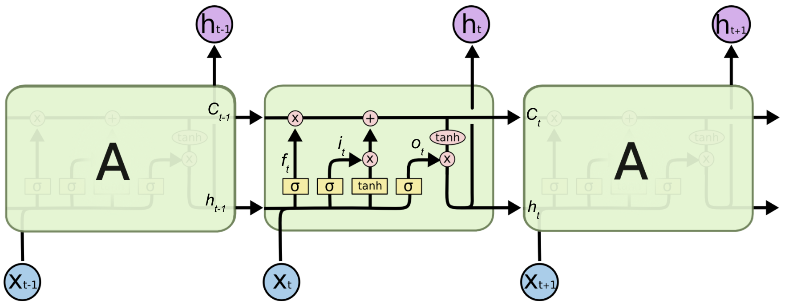

```{r setup, include=FALSE}
knitr::opts_chunk$set(
  collapse = TRUE,
  message = FALSE,
  warning = FALSE,
  comment = "#>",
  fig.width = 5,
  fig.height = 3,
  echo = FALSE,
  kable.force.latex = TRUE,
  fig.pos = "H",
  fig.align = "center"
)
library(magrittr)
library(dplyr)
library(tsibble)
library(readr)
library(lubridate)
library(ggplot2)
library(fabletools)
library(feasts)
library(gridExtra)
library(GGally)
library(tidyr)
library(readr)
library(dplyr)
library(tsibble)
library(fabletools)
library(feasts)
library(ggplot2)
library(lubridate)
library(caret)
library(gridExtra)
library(corrplot)
library(tidyr)
library(GGally)
library(fable)
library(fable.prophet)
library(scales)
library(readr)
library(dplyr)
library(tsibble)
library(fabletools)
library(feasts)
library(ggplot2)
library(lubridate)
library(caret)
library(gridExtra)
library(corrplot)
library(tidyr)
library(GGally)
library(e1071)
options(scipen = 999)
load("BikeFinal.RData")
mykable <- function(...) {
  a <- list(...)
  a$booktabs <- TRUE
  a$format <- "latex"
  do.call(knitr::kable, args = a) %>%
    kableExtra::kable_styling(latex_options = c("HOLD_position", "striped"),
                  stripe_color = "platinum") %>% 
    kableExtra::row_spec(0, background = "black", color = "white", bold = TRUE)
}
```

\newcommand{\argmin}{\mathop{\mathrm{argmin}}}
\definecolor{platinum}{rgb}{0.9, 0.89, 0.89}

# Introduction

While the concept of renting transportation has been around for decades in
the form of rental car companies, such as those often found at airports, it
has also been adapted to the modern "sharing economy" in the form of
bikeshare programs. These programs, often offered by local governments, allow
users to rent bicycles for individual (point-to-point) trips, such as commuting
to and from work. Cycling can be a faster mode of transportation than walking
and might even be faster than driving or taking a taxi in the most congested
of cities. Finally, bicycles offer a lower-pollution alternative to driving,
which can be appealing to cities struggling to contain emissions.

A key challenge faced by administrators of bikesharing programs is the efficient
allocation of available bicycles. Bikes must be available in the places that
people need them and at the time they are needed in order for the program to
be effective. In order to efficiently allocate bikes,
@schuijbroek suggest administrators can
periodically transport bikes from areas of low demand to areas of high demand.
Demand in a bikeshare system is a function of both time
and location. In this paper we focus on the time component of
the demand for bicycles at each hour of the day, ignoring the spatial
component of demand. We will use the Seoul Bike Sharing Demand data from
@bikedata. Our focus will be limited to predicting demand at each hour
of the day, ignoring inferential aspects of the analysis. While much of the
recent research using this dataset has focused on machine learning
methodologies, we will take a multifaceted approach that incorporates
advances in time series modeling in addition to the popular machine learning
methodologies.

This paper begins with a review of the [relevant literature](#literature),
including studies of the Seoul data specifically. Next, we present the results
of the [exploratory data analysis](#exploratory-analysis), including a
description of the dataset and relevant profiles of the features. The
fourth section describes the [modeling](#modeling) techniques to be applied to
the data. The fifth section describes the
[evaluation](#evaluation) techniques to be used
for measuring model performance and selecting the best model. The penultimate
section presents the [results](#results) of the analysis and a discussion in
the context of the problem to be solved. Finally, the [conclusion](#conclusion)
provides suggestions for action and application of the results, while also
highlighting potential areas of future research.

# Literature

The popularity and accessibility of the Seoul bike dataset has resulted in its
use for numerous studies. A majority of these studies have focused on the
use of various machine learning algorithms. @sathishkumar found that
a CUBIST model, which combines tree- and regression-based methods into a series
of rules, performed best on the Seoul data when measured by $R^2$ and RMSE on
the testing dataset. @gao found that another tree-based
method, random forest (RF), performed best on a similar bikeshare dataset when
measured by $R^2$ and RMSE. Both studies further showed
that weather-related variables, such as temperatures and precipitation, where
among the most important for predicting demand. Gao and Chen's results
highlight the importance of selecting a relevant evaluation metric and explanatory
variables. When socioeconomic variables were included in the model, the
RF outperformed the support vector machine (SVM) when measured by both
RMSE and MAE. However, when the socioeconomic variables were excluded from the
model, the RF outperformed the SVM when measured by RMSE, but the SVM
performed better when measured by MAE This indicates that without the
socioeconomic variables included, the SVM was prone to a few errors that were
quite large in magnitude, while the RF was more prone to smaller but more
frequent errors. This reinforces the importance of using multiple metrics when
evaluating predictions.

Considerably fewer researchers have made use of traditional time series
methodologies when predicting demand of a similar nature to the bikeshare data.
Both @sathishkumar and @gao make use of temporal variables such as hour,
day of the week, and holidays. In each case they were found to be of moderate or
high importance. @gao applied linear regression using temporal
variables such as a weekend indicator as a predictor, but this model greatly
underperformed the machine learning methods. Further, there is no discussion of
any attention paid to stationarity and autoregression, which are common in time
series data but may also result in violations of the standard assumptions of
linear regression.

Our analysis looks to build on this work by using newer machine learning
methods such as long short-term memory and recurrent neural networks, as well
as modern time series techniques that leverage the underlying structure of the
data.

# Exploratory Analysis

```{r read-data}
bike <- readr::read_csv("SeoulBikeData.csv",
                        col_names = c("Date",
                                      "BikeCount",
                                      "Hour",
                                      "Temperature",
                                      "Humidity",
                                      "WindSpeed",
                                      "Visibility",
                                      "Dewpoint",
                                      "SolarRadiation",
                                      "Rainfall",
                                      "Snowfall",
                                      "Seasons",
                                      "Holiday",
                                      "FunctionalDay"),
                        skip = 1,
                        col_types = cols("Hour" = col_time(format = "%H"),
                                         Seasons = "f",
                                         Holiday = "f",
                                         FunctionalDay = "f")) 

bikets <- bike %>%
  mutate(
    Hour = parse_date_time(
      paste(Date, Hour),
      orders = c("dmy HMS", "dmY HMS"),
      tz = "Asia/Seoul"
    ),
    .before = everything(),
    Date = NULL,
    BikeCount = ifelse(FunctionalDay == "Yes", BikeCount, NA),
    FunctionalDay = NULL,
    Holiday = forcats::fct_relevel(Holiday, "No Holiday"),
    Workday = factor(ifelse(((lubridate::wday(Hour, label = TRUE) %in% c("Sat", "Sun")) | Holiday == "Holiday"), "Not Workday", "Workday"), levels = c("Workday", "Not Workday"))
  ) %>%
  as_tsibble(index = Hour)
```

```{r dictionary}
tibble::tribble(
  ~Variable, ~name, ~Type, ~Definition,
  "Hour", "Hour", "datetime", "year-month-day hour:minute:second",
  "Rented Bike count", "BikeCount", "numeric", "Count of bikes rented at each hour",
  "Temperature", "Temperature", "numeric", "Temperature in Celsius",
  "Humidity", "Humidity", "numeric", "% humidity",
  "Windspeed", "WindSpeed", "numeric", "meters/second",
  "Visibility", "Visibility", "numeric", "in 10m",
  "Dew point temperature", "Dewpoint", "numeric", "Celsius",
  "Solar radiation", "SolarRadtion", "numeric", "MJ/m2",
  "Rainfall", "Rainfall", "numeric","mm",
  "Snowfall", "Snowfall", "numeric","cm",
  "Seasons", "Seasons", "categorical", "Winter, Spring, Summer, Autumn",
  "Holiday", "Holiday", "categorical", "Holiday/No holiday",
  "Functional Day", "FunctionalDay", "categorical", "NoFunc(Non Functional Hours), Fun(Functional hours)",
  "Workday", "Workday", "categorical", "A workday is a weekday that is not a holiday."
) %>%
  mykable(caption = "Variable definitions",
               label = "var-defs")
```

The dataset consists of `r scales::comma(nrow(bikets))` hourly observations of
`r ncol(bikets)-1` variables from
`r paste(range(bikets$Hour), collapse = " to ")`. There are
`r sum(is.na(bikets$BikeCount))` observations where *BikeCount*=0 due to the
bikeshare system not functioning. There are no other periods where
*BikeCount*=0. Table \ref{tab:var-defs} contains information on the variables in
the dataset, including the 

## Bike Count

```{r timeplot, fig.width=8, fig.cap="Hourly bike demand"}
biketimeplots <- gg_tsdisplay(bikets, BikeCount, plot_type = "histogram", lag_max = 24*7) +
  labs(title = "Hourly Bike Demand")
biketimeplots[[1]]$layers[[2]] <- NULL
biketimeplots[[1]]$layers[[1]]$aes_params$size <- .2
biketimeplots
```

The data shows increasing demand and variability during the summer months. The
bike demand data are counts, meaning they are technically discrete. Based on
the histogram and the count nature of the data, it appears that a poisson
distribution would be most appropriate for the data. If we were to model the
bike demand on a continuous scale, a log-normal distribution might be
appropriate.

Figure \ref{fig:timeplot} highlights the incredible variation in demand over time.
The variance in demand appears to increase during the summer months and then
decrease again in the autumn. This heteroskedasticity violates the constant
variance assumption of ordinary least squares regression and will have to be
corrected if regression-based methods are to be used. We can also see that the
mean of the series appears to increase during the summer months before decreasing
again in the autumn.

```{r ts-tests}
tstests <- features(bikets, BikeCount, c(unitroot_kpss,
                                         ~ljung_box(., lag = 24)))
```

@kpss's test yields $p=$ `r tstests$kpss_pvalue`, meaning there is strong
evidence in favor of the presence of a unit root and the data is likely
non-stationary. @ljung's test was conducted up to 24 lags which
resulted in a test statistics of `r round(tstests$lb_stat)` with
$p=$ `r tstests$lb_pvalue`, indicating strong evidence that there is serial
correlation in the hourly bike count. The acf plot in Figure 1 shows
that autocorrelation is significant at most lags out to 168 hours, which
represents the same hour of the same day in the previous week. The strong
serial correlation makes this dataset a good candidate for time series
techniques.

```{r season-plots, fig.width = 8, fig.cap="Hourly bike demand by time period"}
grid.arrange(
ggplot(bikets, aes(x = format(Hour, "%H"), y = BikeCount, fill = lubridate::hour(Hour))) +
  geom_boxplot() +
  scale_fill_viridis_b() +
  labs(x = "Hour of Day", title = "Hourly Bike Count by Hour", y = "Hourly Bike Demand") +
  theme(legend.position = "none", axis.text.x = element_text(size = 7)),
ggplot(bikets, aes(x = lubridate::wday(Hour, label = TRUE), y = BikeCount, fill = lubridate::wday(Hour, label = TRUE))) +
  geom_boxplot() +
  labs(x = "Day of Week", title = "Hourly Bike Count by Day of Week", y = "Hourly Bike Demand") +
  theme(legend.position = "none"),
ggplot(bikets, aes(x = Workday, y = BikeCount, fill = Workday)) +
  geom_boxplot() +
  scale_fill_viridis_d() +
  labs(x = "Workday Indicator", title = "Hourly Bike Count by Working Day", y = "Hourly Bike Demand") +
  theme(legend.position = "none"),
ggplot(bikets, aes(x = Seasons, y = BikeCount, fill = Seasons)) +
  geom_boxplot() +
  scale_fill_viridis_d() +
  labs(x = "Season", title = "Hourly Bike Count by Season", y = "Hourly Bike Demand") +
  theme(legend.position = "none"),
newpage = FALSE
)
```

Figure \ref{fig:season-plots} highlights various seasonal and temporal patterns in the data. There
is certainly an effect based on the hour of day, with demand increasing
sharply in the morning, presumably during the morning commute, before decreasing
into the lunchtime hour. From there, demand rises steadily through the evening
commute before peaking around dinner time and then falling through the
nighttime hours. Variability also appears greater during the evening hours,
which is consistent with the idea heteroscedasticity; the variance increases
with the level of the series. Demand appears slightly higher during 
workdays (where workdays are weekdays that are not holidays) and weekdays,
though the difference does not appear particularly large. There are a number
of large positive outliers during the weekdays. Finally, demand appears
largest during the summer months and smallest during the winter, as biking would
be a less desirable option in the cold.

```{r seasonality-weekends, fig.cap="Hourly bike demand by type of day, highlighting differing seasonality between workdays and non-workdays", fig.height=3, fig.width=4.5}
grid.arrange(
bikets[1000:1672,] %>%
  select(Hour, BikeCount, Workday) %>%
  mutate(`Not Workday` = ifelse(Workday == "Not Workday", BikeCount, NA),
         `Workday` = ifelse(Workday == "Workday", BikeCount, NA)) %>%
  tidyr::gather("Day Type", "BikeCount", `Workday`, `Not Workday`) %>%
ggplot(aes(x = Hour, y = BikeCount, color = `Day Type`)) +
  geom_line() +
  theme(legend.position = "top",
        axis.title.x = element_text(size = 7),
        axis.text.x = element_text(size = 6),
        axis.title.y = element_text(size = 7),
        axis.text.y = element_text(size = 6),
        title = element_text(size = 8),
        legend.text = element_text(size = 4),
        legend.title = element_text(size = 5)) +
  labs(title = "Hourly Demand by Day Type",
       x = "Hour (1/11/2018 to 2/8/2018)"),
bikets[3000:3672,] %>%
  select(Hour, BikeCount, Workday) %>%
  mutate(`Not Workday` = ifelse(Workday == "Not Workday", BikeCount, NA),
         `Workday` = ifelse(Workday == "Workday", BikeCount, NA)) %>%
  tidyr::gather("Day Type", "BikeCount", `Workday`, `Not Workday`) %>%
ggplot(aes(x = Hour, y = BikeCount, color = `Day Type`)) +
  geom_line()+
  theme(legend.position = "none", 
        axis.title.x = element_text(size = 7),
        axis.text.x = element_text(size = 6),
        axis.title.y = element_text(size = 7),
        axis.text.y = element_text(size = 6)) +
  labs(x = "Hour (4/4/2018 to 5/2/2018)"),
bikets[5000:5672,] %>%
  select(Hour, BikeCount, Workday) %>%
  mutate(`Not Workday` = ifelse(Workday == "Not Workday", BikeCount, NA),
         `Workday` = ifelse(Workday == "Workday", BikeCount, NA)) %>%
  tidyr::gather("Day Type", "BikeCount", `Workday`, `Not Workday`) %>%
ggplot(aes(x = Hour, y = BikeCount, color = `Day Type`)) +
  geom_line()+
  theme(legend.position = "none", 
        axis.title.x = element_text(size = 7),
        axis.text.x = element_text(size = 6),
        axis.title.y = element_text(size = 7),
        axis.text.y = element_text(size = 6)) +
  labs(x = "Hour (6/27/2018 to 7/25/2018)"),
bikets[6000:6672,] %>%
  select(Hour, BikeCount, Workday) %>%
  mutate(`Not Workday` = ifelse(Workday == "Not Workday", BikeCount, NA),
         `Workday` = ifelse(Workday == "Workday", BikeCount, NA)) %>%
  tidyr::gather("Day Type", "BikeCount", `Workday`, `Not Workday`) %>%
ggplot(aes(x = Hour, y = BikeCount, color = `Day Type`)) +
  geom_line()+
  theme(legend.position = "none", 
        axis.title.x = element_text(size = 7),
        axis.text.x = element_text(size = 6),
        axis.title.y = element_text(size = 7),
        axis.text.y = element_text(size = 6)) +
  labs(x = "Hour (8/7/2018 to 9/4/2018)"),
newpage = FALSE)
```

Figure \ref{fig:seasonality-weekends} provides insight into the seasonality of the bike demand. Each panel
is a 4-week sample of hourly bike demand, with non-workdays (weekends and
holidays) highlighted in red. While these days appear to follow a consistent
hourly pattern much like the workdays, we can see that their is a difference
between the seasonality of workdays and the seasonality of non-workdays. Most
notably, the troughs in demand appear consistent between the types of days
while the peaks are consistently higher for workdays as compared to
non-workdays. This changing seasonality based on type of day will need to be
captured in our model.

Continuing with the impact of seasonality and temperature on demand, we will
next explore covariates included with the dataset.

## Covariates

This dataset includes a number of covariates to aid in modeling bike demand.
All of these covariates are listed in Table 1, along with their definitions.
The covariates fall into one of two broad categories: weather and
social. Weather covariates include variables such as temperature, humidity,
precipitation, and others. Social variables capture the impact of calendar-based
human behavior, such as holidays and weekends.

```{r covariate-timeplot, fig.cap="Hourly time plots of covariates", fig.height=4.5}
bikets %>%
  select(Hour, where(is.numeric)) %>%
  select(-BikeCount) %>%
  pivot_longer(cols = -Hour,
               names_to = "Measure",
               values_to = "Value") %>%
  ggplot(aes(x = Hour, y = Value, color = Measure)) +
  geom_line(size = .25) +
  facet_grid(rows = vars(Measure), scales = "free_y") +
  labs(title = "Hourly time plot of covariates", x = NULL, y = NULL) +
  theme(legend.position = "none",
        strip.text.y = element_text(size = 4),
        axis.text.y = element_text(size = 5))
```

Time plots of the covariates (Figure \ref{fig:covariate-timeplot})
show a dynamic set of variables. Most of the
covariates appear to be typical time series data with varying degrees of
trend, seasonality, cyclicality, autocorrelation, and heteroskedasticity.
Dewpoint and Solar Radiation follow a predictable pattern that mirrors
temperature throughout the year, with an upward trend peaking in the summer
months and downward trend that hits a trough in the winter months. Humidity, 
visibility, and Wind Speed appear to have less of a trend throughout the year.
Precipitation (rainfall and snowfall) appears to have a much more random
pattern throughout the year, with a large number of periods having no
precipitation. Depending on the predictive performance of the raw continuous
precipitation features, it may prove more performant to convert them to
binary variables that simply indicate if precipitation occurred during that
period.

```{r corrplot, fig.width=6, fig.height = 4, fig.cap="Scatterplots and smoothed GAM fits of Bike Count vs. each covariate", dev = "CairoPDF"}
plotdf <- select(bikets, where(is.numeric)) %>%
  as_tibble() %>%
  pivot_longer(-c(Hour, BikeCount), names_to = "Covariate", values_to = "Value") %>%
  select(-Hour) %>%
  group_by(Covariate) %>%
  mutate(p = cor(Value, BikeCount, use = "complete.obs"))

cordf <- plotdf %>%
  group_by(Covariate) %>%
  summarise(p = mean(p), mx = max(Value))

plotdf %>%
  ggplot(aes(x = Value, y = BikeCount)) +
  geom_point(size = .075) +
  geom_label(data = cordf, mapping = aes(x = mx*.8, y = 3000, label = paste("\u03c1","=", round(p,3))), size = 2) +
  facet_wrap(vars(Covariate), nrow = 3, ncol = 3, scales = "free_x") +
  scale_y_continuous(limits = c(0, NA)) +
  scale_x_continuous(name = "Covariate Value") +
  geom_smooth(size = 0.35) +
  theme(strip.text = element_text(size = 8), axis.text = element_text(size = 6))
  # ggpairs() +
  # theme(axis.text = element_blank(),
  #       axis.ticks = element_blank(),
  #       text = element_text(size = 8))
```


Figure \ref{fig:corrplot} highlights a number of important relationships in the data.
Bike count appears moderately linearly correlated with both temperature
($\rho=0.563$) and dewpoint ($\rho=0.400$), though a higher-order interaction
might better represent this relationship. However, there is significant
multicollinearity between temperature and dewpoint ($\rho=0.913$), so
additional analysis will be required to isolate the effect of each variable.
Finally, we can see that a number of the covariates, such as wind speed,
visibility, solar radiation, rainfall, and snowfall all appear to follow
non-normal distributions. As such, their relationship to bike count might be
best represented with a higher-order polynomial or other non-linear
relationship.

# Modeling

The modeling methods we have chosen for predicting bike demand fall into
roughly two categories: parametric time series modeling and non-parametric
machine learning. The parametric time series models include traditional
time series methods like ARIMA and modern methods including the regression-based
Prophet and dynamic linear model FASSTER. The non-parametric machine learning
methods include random forests, boosted trees, and Long Short-Term Memory
neural networks.

The stated goal of this analysis is to predict bike demand, not to conduct
statistical inference (on the factors that impact bike demand). Therefore, the
non-parametric methods can be used freely despite their typical lack of
inferential ability. Further, we do not have to constrain ourselves to the
typical assumptions of parametric methods that are required for inference,
namely independent observations and normally distributed residuals with
mean zero and constant variance. The assumption of independent observations is
obviously violated in time series data and most often appears in the form of
autocorrelated errors. Therefore, the ability to disregard the assumptions
required for inference in favor of a focus on prediction will greatly expand
the number of viable methods for modeling the data.

## Time Series Modeling

```{r tscv-data}
bikets_cv <- filter_index(bikets, . ~ "2018-10-11 23:00:00 KST")


bikets_cv_stretched <- stretch_tsibble(slice_head(bikets_cv, n = -24),
                                   .step = 24,
                                   .init = nrow(bikets_cv)*.8,
                                   .id = "fold")
```

Figure \ref{fig:timeplot} highlights the heteroskedasticity in the bike demand.
This can be corrected using a @boxcox's transformation.
If we let $x_t$ represent the value of raw Bike Count data and $y_t$ represent
the transformed data, we have

\begin{equation}
\label{eq:bc}
y_t=\frac{x_t^{\lambda}-1}{\lambda}
\end{equation}

```{r bc}
l <- bikets_cv %>%
  features(BikeCount, features = guerrero) %>%
  pull(lambda_guerrero)
```

where $\lambda=$ `r l` was selected using @guerrero's method.

### SARIMAX

Traditional linear regression models can be adapted to handle the autocovariance
structure of time series by assuming that the errors follow a seasonal ARIMA 
(SARIMA) process
instead of the traditional $\epsilon\sim\text{iid }N(0,\sigma^2)$. This results
in the modified regression equation

\begin{equation}
\label{eq:ols}
y_t=\beta_0+\sum_{j=1}^k\beta_jz_{jt}+x_t
\end{equation}

where:

* $y_t$ is the response variable at time $t$
* $\beta_0$ is the traditional intercept
* $z_{1t},\dots,z_{kt}$ are the $k$ exogenous regressors observed at
time $t$.
* $\beta_1,\dots,\beta_k$ are the regression coefficients.
* $x_t$ are the regression errors, which are assumed to follow an SARIMA process
as in (\ref{eq:sarima}).

(\ref{eq:ols}) is often referred to as SARIMAX for
Seasonal ARIMA with eXogenous regressors.

\begin{equation}
\label{eq:sarima}
\Phi_P(B^S)\phi(B)\nabla_S^D\nabla^dx_t=\Theta_Q(B^S)\theta(B)w_t
\end{equation}

where:

* $\Phi_P(B^S)$ are the $P$ seasonal autoregressive components
* $\phi(B)$ are the $p$ autoregressive components
* $\nabla_S^D$ are the $D$ seasonal differences
* $\nabla^d$ are the $d$ differences
* $\Theta_Q(B^S)$ are the $Q$ seasonal moving average components
* $\theta(B)$ are the $q$ moving average components
* $w_t\sim\text{ iid }N(0,\sigma_w^2)$ is the traditional Gaussian white noise

as degined by @shumway. SARIMA models of this form are often written
$ARIMA(p,d,q)\times(P,D,Q)_S$. A KPSS test indicates that the data is
non-stationary and requires $D=1$ seasonal difference.
Autocorrelation and partial
autocorrelation plots can be used to determine the ARIMA order.

```{r acf, fig.cap="Correlograms for $\\nabla_Sy_t$", fig.height=2}
grid.arrange(
bikets_cv %>%
  mutate(BikeCount = difference(box_cox(BikeCount, l), lag = 24)) %>%
  ACF(BikeCount, lag_max = 24*7) %>%
  autoplot() + labs(title = expression(paste("ACF of ", nabla[S]*y[t]))) + theme(axis.title.y = element_blank(), axis.text.x = element_text(size = 5)),
bikets_cv %>%
  mutate(BikeCount = difference(box_cox(BikeCount, l), lag = 24)) %>%
  PACF(BikeCount, lag_max = 24*7) %>%
  autoplot()+ labs(title = expression(paste("PACF of ", nabla[S]*y[t]))) + theme(axis.title.y = element_blank(), axis.text.x = element_text(size = 5)),
ncol = 2)
```

Figure \ref{fig:acf} indicates a seasonal autoregressive model with $P=6$ and $p\ge12$.
This is a large number of seasonal autoregressive terms and will almost
certainly result in characteristic roots inside the unit circle, causing
the model to be unstable. A quick search of the
parameter space using the `R` function `ARIMA` 
@fable's `fable` package to automatically select values for
$p, d, q, Q$ results in no stable $ARIMA(p,d,q)\times(6,1,Q)_{24}$ models
being found.

When the data
exhibit higher frequency or multiple types of seasonality (such as daily and
weekly, in our case), an alternative solution for modeling seasonality
suggested by @fpp3 can be to use fourier terms. 
Introducing the fourier terms will result in a model of the form


\begin{align}
\label{eq:arimafourier}
y_t&=\beta_0+\sum_{j=1}^k\beta_jz_{jt}+s_d(t,m)+s_w(t,n)+x_t\\
\label{eq:fourierday}
s_d(t,m)&=\sum_{i=1}^m\left[\alpha_i\sin\left(\frac{2\pi it}{24}\right)+\beta_i\cos\left(\frac{2\pi it}{24}\right)\right]\\
\label{eq:fourierweek}
s_w(t,n)&=\sum_{l=1}^n\left[\gamma_l\sin\left(\frac{2\pi lt}{168}\right)+\delta_l\cos\left(\frac{2\pi lt}{168}\right)\right]
\end{align}

where:

* $\beta_0+\sum_{j=1}^k\beta_jz_{jt}$ are the intercept, independent variables
and their coefficients, as defined in (\ref{eq:ols})
* $s_d(t,m)$ are the $m$ daily seasonality fourier terms
* $s_w(t,n)$ are the $n$ weekly seasonality fourier terms
* $x_t$ are the model errors, which are assumed to follow a $ARIMA(p,d,q)$
process (note that in contrast to (\ref{eq:ols}) this is a non-seasonal ARIMA
model; the seasonality is omitted from the ARIMA process because it is captured
by the fourier terms).

The R function `fable::ARIMA` is used to fit this model, which, as @arimamissing
notes, handles missing values automatically using a Kalman filter.
As a result of the missing values, the point (parameter) estimates will
likey be biased. The use of covariates may capture some of the pattern in
the missing data, if there is any, which would help to reduce the bias.
However, the final point forecasts will likely still have some bias.

```{r arima-fourier, fig.height=4, fig.cap="Residuals for an ARIMAX(2,1,2) model with daily and weekly fourier terms"}
# model(bikets_cv, ARIMA(box_cox(BikeCount, l) ~ pdq() + PDQ(0,0,0) + fourier(24, 10) + fourier(24 * 7, 40) + Dewpoint + Humidity + Rainfall + SolarRadiation + Temperature + Visibility + WindSpeed + Seasons + Workday))
# ARIMAfourier <- model(bikets_cv, ARIMA(box_cox(BikeCount, l) ~ pdq(2,1,2) + PDQ(0,0,0) + fourier(24, 10) + fourier(24 * 7, 40) + Dewpoint + Humidity + Rainfall + SolarRadiation + Temperature + Visibility + WindSpeed + Seasons + Workday))

format_tsdisplay <- function(x) {
  x[[1]]$layers[[2]] <- NULL
  x[[1]]$layers[[1]]$aes_params$size <- .15
  x[[2]]$theme$axis.text.x <- element_text(size = 4)
  x[[3]]$theme$axis.text.x <- element_text(size = 4)
  x
}

x <- ARIMAfourier %>%
  residuals() %>%
  gg_tsdisplay(.resid, plot_type = "partial", lag_max = 24*7) +
  labs(title = "ARIMAX(2,1,2) with daily & weekly fourier terms")
x <- format_tsdisplay(x)
x
```

The fourier model resulted in the selection of an $ARIMA(2,1,2)$ process for the
regression residuals. The residual ACF and PACF plots from the fourier model
(Figure \ref{fig:arima-fourier}) still show significant autocorrelation.
Autocorrelation in the residuals violates the Gauss-Markov assumptions, meaning
the model should not be used for inference. The goal of this analysis is to
generate accurate (point) forecasts, which are still valid even when the errors
exhibit autocorrelation.

Next we will fit a linear regression with SARIMA errors to the data where
all parameters
$p,d,q,P,D,Q$ are chosen automatically using `fable::ARIMA`, which relies on
the algorithm developed by @autoarima. This resulted in the selection of an
$SARIMA(1,0,1)\times(5,1,0)_{24}$ for $x_t$.

```{r auto-sarima, fig.height = 4, fig.cap="Residuals for an $SARIMAX(1,0,1)\\times(5,1,0)_{24}$"}
# model(bikets_cv, ARIMA(box_cox(BikeCount, l) ~ pdq() + PDQ() + Dewpoint + Humidity + Rainfall + SolarRadiation + Temperature + Visibility + WindSpeed + Seasons + Workday))
# ARIMAauto <- model(bikets_cv, ARIMA(box_cox(BikeCount, l) ~ pdq(1,0,1) + PDQ(5,1,0) + Dewpoint + Humidity + Rainfall + SolarRadiation + Temperature + Visibility + WindSpeed + Seasons + Workday))
x <- ARIMAauto %>%
  residuals() %>%
  gg_tsdisplay(.resid, plot_type = "partial", lag_max = 24*7)+
  labs(title = expression(paste("SARIMAX(1,0,1)"%*%"(5,1,0)"[24])))

x <- format_tsdisplay(x)
x
```

Figure \ref{fig:auto-sarima} shows that, while the autocorrelation (and partial autocorrelation)
for a $SARIMA(1,0,1)\times(5,1,0)_{24}$ model
has been reduced over the $ARIMAX(2,1,2)$ with fourier terms, there is still
repeating statistically significant autocorrelation.

Finally, we will test a SARIMAX model that makes use of two derived
variables. First, as was seen in Figure \ref{fig:corrplot}, there appears to
be a higher-order relationship between temperature and bike count. Therefore,
we will add a $\text{Temperature}^2$ term to the model. Additionally, as can
be seen in \ref{fig:covariate-timeplot}, Rainfall and Snowfall are both
continuous variables that have a large number of zero values. We believe it is
a reasonable assumption that the presence or absence of Rainfall or Snowfall
will have the largest impact on the bike count, and the quantity of rain or snow
is only marginal in effect compared with the presence or absence rain or snow.
Further, we believe that any precipitation, regardless of type, will impact
bike count, and the type (and quantity) of precipitation is of much less
importance. Therefore, we will create a derived indicator variable
`Precipitation_Flag` to identify the presence of any precipitation,
defined as follows:

\begin{equation}
\label{eq:precip-flag}
\text{Precipitation Flag}=\begin{cases}
1,& \text{Rainfall}>0\text{ or }\text{Snowfall}>0\\
0,& otherwise
\end{cases}
\end{equation}


```{r auto-sarima-poly, fig.height = 4, fig.cap="Residuals for an $SARIMAX(1,0,1)\\times(5,1,0)_{24}$ with $\\text{Temperature}^2$ and $\\text{Precipitation Flag}$"}
bikets_cv <- bikets_cv %>%
  mutate(Precipitation_Flag = (Rainfall + Snowfall) > 0,
         TSquare = Temperature ^ 2)
# arimaT2Precip <- bikets_cv %>% model(
#            arimaT2Precip = ARIMA(
#              box_cox(BikeCount, l) ~ 1 + pdq(1, 0, 1) + PDQ(5, 1, 0) + Humidity + Precipitation_Flag + SolarRadiation + Temperature + TSquare + Visibility + WindSpeed + Seasons + Workday
#            )
#          )
arima_ic_comp <- glance(bind_cols(ARIMAauto,arimaT2Precip))

x <- arimaT2Precip %>%
  residuals() %>%
  gg_tsdisplay(.resid, plot_type = "partial", lag_max = 24*7)+
  labs(title = expression(paste("SARIMAX(1,0,1)"%*%"(5,1,0)"[24]~"with"~"Temperature"^2~"and  Precipitation_Flag")))

x <- format_tsdisplay(x)
x[[1]]$theme$title = element_text(size = 8)
x
```

The addition of $\text{Temperature}^2$ and $\text{Precipitation Flag}$ have
reduced AIC from `r paste(round(arima_ic_comp$AIC), collapse = " to ")`,
AICc from `r paste(round(arima_ic_comp$AICc), collapse = " to ")`,
and BIC from `r paste(round(arima_ic_comp$BIC), collapse = " to ")`, when
compared with the model from Figure \ref{fig:auto-sarima}. Therefore
the addition of these two variables has helped improve the model fit. 
Unfortunately, as \ref{fig:auto-sarima-poly} shows there is still
statistically significant autocorrelation in the residuals
It is possible that the
seasonal patterns in the data are too complex or too high frequency to be
captured by an ARIMA, ARIMAX, or SARIMAX model. As a result of the residual
variance structure, prediction intervals cannot be generated with these models,
though point estimates are still valid.

In an effort to overcome the current residual structure 
we will explore more modern time series techniques.

### Prophet

@prophet's Prophet uses a generalized additive model (GAM) to capture the different
features of the time series. Our model will take the form

\begin{equation}
\label{eq:prophet}
y(t)=g(t)+s_d(t,m)+s_w(t,n)+\sum_{j=1}^k\beta_jz_{jt}+\epsilon_t
\end{equation}

where:

* $g(t)$ is a piecewise constant function to represent the trend in the series
* $s_d(t,m)$ as in (\ref{eq:fourierday})
* $s_w(t,n)$ as in (\ref{eq:fourierweek})
* $\sum_{j=1}^k\beta_jz_{jt}$ is as in \ref{eq:ols}
* $\epsilon_t$ is the model error

One major benefit of (\ref{eq:prophet}) is that it is much faster to fit than
a model with ARIMA terms. The downside is that it does not explicitly capture
(non-seasonal) $AR(p)$ and $MA(q)$ terms. As @prophet note, because this is
a curve-fitting exercise rather than a generative model, missing values do
not need to be manually imputed. Instead, the curves $g(t)$, $s_d(t,m)$, and
$s_w(t,n)$ are fit to the raw data and then used to impute the missing values.
Further, as with the ARIMA model, the presence of the covariates helps to
control for any missingness that might be related to one of the covariates.
However, the missing value interpolation will still result in biased parameter
estimates for the model.

We will use
`prophet` from @fableprophet's package `fable.prophet` to train the model in `R`.
The `R`
function sets a number of desirable default parameter values as
recommended by @prophet. In order to properly tune the model to our dataset
we will use TSCV (see [Model Selection and Test Error](#Model-Selection-and-Test-Error)) to select $m$ and $n$. The TSCV will
consist of 63 folds/time-slices. We will search over the parameter space
$m\in\{1, 2, 5, 10, 20, 50\}$ and $n\in\{3, 5, 10, 20, 50\}$, giving us
$6\times5=30$ possible parameter combinations.

```{r prophet-cv, fig.cap="Cross-validated MAE for Prophet models with various numbers of (daily and weekly) fourier terms", fig.height=3, fig.width=3}
holidays <- bikets_cv %>%
  filter(Holiday == "Holiday") %>%
  mutate(ds = as.Date(Hour)) %>%
  distinct(ds) %>%
  mutate(holiday = "holiday")

## Fourier terms
# prophet_fourier_cv <- expand_grid(day = c(1, 2, 5, 10, 20, 50),
#                                   week = c(3, 5, 10, 20, 50)) %>%
#   mutate(
#     mdl = future_map2(day, week, function(d, w, bikets_cv_stretched, l, bikets) {
#       bikets_cv_stretched %>%
#         model(
#           prophet = prophet(
#             box_cox(BikeCount, l) ~ season(
#               period = "day",
#               type = "additive",
#               order = d,
#               name = "day"
#             ) + season(
#               period = "week",
#               type = "additive",
#               order = w,
#               name = "week"
#             ) + growth() + Workday + Dewpoint + Humidity + Rainfall + SolarRadiation + Temperature + Visibility + WindSpeed + Seasons
#           )
#         ) %>%
#         forecast(
#           new_data = new_data(bikets_cv_stretched, n = 24) %>%
#             inner_join(bikets, by = "Hour") %>%
#             mutate(
#               BikeCount = na_if(BikeCount, 0),
#               Workday = factor(
#                 gsub(" ", "", as.character(Workday)),
#                 levels = c("Workday", "NotWorkday")
#               )
#             )
#         ) %>%
#         accuracy(data = bikets)
#     }, bikets_cv_stretched = bikets_cv_stretched, l = l, bikets = bikets, .options = furrr_options(seed = TRUE), .progress = TRUE)
#   )

prophet_fourier_cv <- structure(list(day = structure(c(1L, 1L, 1L, 1L, 1L, 2L, 2L, 
2L, 2L, 2L, 3L, 3L, 3L, 3L, 3L, 4L, 4L, 4L, 4L, 4L, 5L, 5L, 5L, 
5L, 5L, 6L, 6L, 6L, 6L, 6L), .Label = c("1", "2", "5", "10", 
"20", "50"), class = "factor"), week = structure(c(1L, 2L, 3L, 
4L, 5L, 1L, 2L, 3L, 4L, 5L, 1L, 2L, 3L, 4L, 5L, 1L, 2L, 3L, 4L, 
5L, 1L, 2L, 3L, 4L, 5L, 1L, 2L, 3L, 4L, 5L), .Label = c("3", 
"5", "10", "20", "50"), class = "factor"), MAE = c(365.105299071547, 
364.95245347683, 363.393678198711, 307.339502718768, 273.406754695837, 
321.085658194055, 320.760611535959, 319.981972651726, 307.429216334244, 
273.486947095138, 304.917905827215, 305.364486550836, 301.154567694556, 
285.250471917666, 273.239637157694, 302.328145809333, 303.182360025435, 
298.950654734633, 280.10231949376, 272.182229877828, 302.95634912311, 
302.755944321119, 299.570668869166, 279.378451608946, 271.857750727527, 
302.308493806848, 302.394497389872, 298.797209802857, 279.496729378455, 
271.424610246633)), row.names = c(NA, -30L), class = c("tbl_df", 
"tbl", "data.frame"))

prophet_fourier_cv %>%
  ggplot(aes(x = day, y = week, label = round(MAE), fill = MAE)) +
  geom_bin_2d() +
  geom_text(size = 2.5) +
  scale_fill_gradient(low = "pink", high = muted("red")) +
  theme_minimal() +
  labs(title = "Prophet out-of-sample MAE",
       x = "m: Number of 'day' fourier terms",
       y = "n: Number of 'week' fourier terms")

```

Figure \ref{fig:prophet-cv} identifies $m=50$ and $n=50$ as the optimal number of fourier terms
(they minimize MAE).
We fit this model to the entire training dataset, including
the two derived variables discussed in the [SARIMAX](#sarimax) section, and analyze the residuals.

```{r prophet-resid, fig.cap="Residual correlograms for a Prophet model with $m=50$ (daily) and $n=50$ (weekly) fourier terms", fig.height=2}
# prophetT2Precip <- bikets_cv %>%
#   mutate(Precipitation_Flag = (Rainfall + Snowfall) > 0,
#          TSquare = Temperature^2) %>%
#   model(
#     prophetT2Precip = prophet(
#       box_cox(BikeCount, l) ~ season(
#         period = "day",
#         type = "additive",
#         order = 50,
#         name = "day"
#       ) + season(
#         period = "week",
#         type = "additive",
#         order = 50,
#         name = "week"
#       ) + growth() + Workday + Humidity + Precipitation_Flag + SolarRadiation + Temperature + TSquare + Visibility + WindSpeed + Seasons
#     )
#   )

grid.arrange(
prophetT2Precip %>%
  residuals() %>%
  ACF(.resid, lag_max = 24*7) %>%
  autoplot() + 
  labs(title = "ACF of Prophet model",
       subtitle = "m=50 daily, n=50 weekly fourier terms") +
  theme(axis.title.y = element_blank(), 
        axis.text.x = element_text(size = 4.5),
        title = element_text(size = 8)),
prophetT2Precip %>%
  residuals() %>%
  PACF(.resid, lag_max = 24*7) %>%
  autoplot() + 
  labs(title = "PACF of Prophet model",
       subtitle = "m=50 daily, n=50 weekly fourier terms") +
  theme(axis.title.y = element_blank(), 
        axis.text.x = element_text(size = 4.5),
        title = element_text(size = 8)),
ncol = 2)
```

As can be seen from the PACF of the residuals in Figure \ref{fig:prophet-resid},
there is still autocorrelation not captured by the model. Therefore, the
model point estimates will be valid but prediction
intervals cannot be generated due to the error structure. This is to be expected,
as @prophet notes that the design of Prophet as a curve-fitting exercise, rather
than a generative model (such as ARIMA) that captures the temporal dependence
of the data, can be expected to give up some inferential capabilities
(in exchange for computational and other benefits).
Given that our
goal is forecasting/prediction rather than inference, this should not pose a
problem for the analysis.

### fasster

One interesting feature of the residual PACFs from both the SARIMAX
model (Figure \ref{fig:auto-sarima}) and the Prophet model (Figure \ref{fig:prophet-resid}) is that
the seasonal "spikes" are parabolic in shape. That is, the PACF starts high
at lag 24, then decreases until reaching a min around lag 72 or
lag 96 before rising again to another peak at lag 168 (which is
the one week lag). This shape might be why the AR and fourier terms are not
capturing all of the autocorrelation in the data: the strength of the
correlation appears to be a non-linear function of time.
One reason for this
shape in the PACF plot could be the presence of switching seasonality. More
specifically, it's possible that the seasonality effects (not just the series itself)
is different on working days and non-working days. A
hand-wavy analysis would say that, given there are seven days in a
week, any single day is, on "average", $7/2=3.5$ days away from any other day.
For weekdays specifically, they are 3.5 days away from a weekend (again, on
average).
Therefore, the trough in the PACF curve occurring between 3 and 4 days
might be due to that lag most frequently correlating weekdays with weekend days,
resulting in lower correlation than when weekdays are compared with other
weekdays, which would occur most frequently at lags $<3$ and $>4$. This is
certainly not a technical explanation of the pattern, but it is plausible. The
previously employed techniques (SARIMAX and Prophet) don't allow for changing
seasonality.

@fasster's fasster methodology allows for the seasonal (and trend)
component(s) of the model to be switched based on the "state" of a given
observation, which is defined via a discrete variable passed to the model. In
our case, this variable would be *Workday*, which identifies the observation
as a workday or non-workday (weekend or holiday). Different seasonality
coefficients can then be fit based on whether a bike count is observed on
a workday or non-workday. Equations \ref{eq:fasster-obs} and
\ref{eq:fasster-state} from
@fasstereqns describe the two functions that support this methodology.
The terms $F_t$ and $G$ operate together to allow for different hourly seasonality
components for workdays and non-workdays. For example, the effect
(coefficient) of the 8:00AM hour can be different for a workday and a
non-workday.
This is an improvement over the previous models,
which simply include the *Workday* variable as a regression coefficient,
reducing its effect to a shift in the level of the series. Like some of the
previous methods, fasster uses fourier terms to capture seasonality. We will
use 10 and 5 $\sin$-$\cos$ for the daily and weekly seasonality, respectively,
based on the recommendation of @fpp3. 

\begin{align}
\label{eq:fasster-obs}
y_t&=F_t\theta_t+v_t,&&v_t\sim N(0,V)\\
\label{eq:fasster-state}
\theta_t&=G\theta_{t-1}+w_t,&&w_t\sim N(0,W)
\end{align}

where:

* $y_t$ is the bike demand at time $t$
* $\theta_t$ are the underlying states at time $t$
* $F_t$ are the coefficients at time $t$ for (linearly) combining the states to
produce the response at time $t$ ($y_t$)
* $G$ is a matrix that defines the behavior of each state (season, trend, level,
etc)
* $v_t$ and $w_t$ are normally distributed random noise with mean 0.

Finally, as with the other time-series
methods, fasster uses Kalman filtering and smoothing to interpolate missing
values, which will result in biased parameter estimates.

```{r fasster, fig.cap="Residual correlograms from the fasster model.", fig.height=2}
library(fasster)
# fassterFourierT2Precip <- bikets_cv %>%
#   mutate(Precipitation_Flag = (Rainfall + Snowfall) > 0,
#          TSquare = Temperature^2) %>%
#   model(fassterFourierT2Precip = fasster(box_cox(BikeCount, l) ~ Workday %S% (fourier(24, 10) + fourier(27*7, 5) + trend(1)) + Humidity + Precipitation_Flag + SolarRadiation + Temperature + TSquare + Visibility + WindSpeed + Seasons)
#         )
grid.arrange(
fassterFourierT2Precip %>%
  residuals() %>%
  ACF(.resid, lag_max = 24*7) %>%
  autoplot() + 
  labs(title = "ACF of FASSTER model") +
  theme(axis.title.y = element_blank(), 
        axis.text.x = element_text(size = 4.5),
        title = element_text(size = 8)),
fassterFourierT2Precip %>%
  residuals() %>%
  PACF(.resid, lag_max = 24*7) %>%
  autoplot() + 
  labs(title = "PACF of FASSTER model") +
  theme(axis.title.y = element_blank(), 
        axis.text.x = element_text(size = 4.5),
        title = element_text(size = 8)),
ncol = 2)
```

As with all of the other time-series models, fasster is not able to capture
the autogression in the series, resulting in significantly autocorrelated
errors. Therefore, point forecasts from the fasster model are valid, but
inference may not be conducted with the model due to the impact of the
autocorrelation on the covariance structure of the model.

```{r fasster-ar, eval=FALSE}
fassterFourierT2Precip <- select(fassterModels, fassterFourierT2Precip)
fasster_resid <- residuals(fassterFourierT2Precip)
fasster_resid_ar <- fasster_resid %>%
  model(fasster_resid_ar = ARIMA(.resid ~ pdq(d=0, q=0) + PDQ(P=0, D=0,Q=0)))
resid_ar_coefs <- fasster_resid_ar %>%
  rename(m1 = .model) %>%
  coefficients()
ar_coefs <- resid_ar_coefs$estimate

fassterFourierT2PrecipAR <- bikets_cv %>%
  mutate(Precipitation_Flag = (Rainfall + Snowfall) > 0,
         TSquare = Temperature^2) %>%
  model(fassterFourierT2PrecipAR = fasster(box_cox(BikeCount, l) ~ Workday %S% (fourier(24, 10) + fourier(27*7, 5) + trend(1)) + ARMA(ar = c(0.614999208742236, 0.125362371648011), ma = 0) + Humidity + Precipitation_Flag + SolarRadiation + Temperature + TSquare + Visibility + WindSpeed + Seasons)
        )

grid.arrange(
fassterFourierT2PrecipAR %>%
  residuals() %>%
  ACF(.resid, lag_max = 24*7) %>%
  autoplot() + 
  labs(title = "ACF of FASSTER model with AR terms") +
  theme(axis.title.y = element_blank(), 
        axis.text.x = element_text(size = 6),
        title = element_text(size = 8)),
fassterFourierT2PrecipAR %>%
  residuals() %>%
  PACF(.resid, lag_max = 24*7) %>%
  autoplot() + 
  labs(title = "PACF of FASSTER model with AR terms") +
  theme(axis.title.y = element_blank(), 
        axis.text.x = element_text(size = 6),
        title = element_text(size = 8)),
ncol = 2)
```

## Machine Learning

### Tree Methods

```{r FE, echo = F, eval = FALSE}
## Feature Engineering


# Create new features
bike$Month = factor(months(bikets$Hour, abbreviate= T)) 
bike$WeekDay = factor(wday(bikets$Hour, label =F, week_start = 1), ordered = F)
bike$Hour = factor(format(bikets$Hour, "%H"))


# convert categorical features to numeric encoding
factors = c("Seasons", "Holiday", "FunctionalDay", "Hour")
bike[,factors] = sapply(bike[,factors], unclass)
bike[,factors] <- lapply(bike[,factors], as.factor)

# create dummy vars
XQual = bike %>% 
  select(-c(Date,BikeCount)) %>%
  select_if(is.factor)
dummyModel = dummyVars(~., data = XQual, fullRank=TRUE)
XQualDummy = predict(dummyModel, XQual)
XQuan = bike %>% select(-c(names(XQual),Date,BikeCount))
XFull = cbind(XQualDummy, XQuan)
```


```{r Imp, echo=F, eval = FALSE}
## Imputation

# Imputing values for Humidity using KNN


XFull = XFull %>%
  mutate(Humidity = ifelse(Humidity == 0, NA, Humidity))%>% # convert 0 to NA before imputing
  select(Humidity) %>%
  preProcess(method='knnImpute') %>% # Note that this automatically centers and scales Humidity
  predict(newdata = XFull)
```

#### Random Forests

Random forests is an ensemble method for regression and classification tasks that is built on decision trees. It extends on the idea of bootstrap aggregation, or bagging, which is used to reduce the variance of a statistical learning method via averaging. In the context of regression trees, this is done by constructing $B$ unpruned trees from $B$ bootstrap samples and averaging the predictions $\hat{f}$ as displayed in Eq. (\ref{eq:rf}).
\begin{equation}
  \label{eq:rf}
  \hat{f}_{bag}(x)=\frac{1}{B}\sum_{b=1}^{B}\hat{f^{*b}}(x)
\end{equation}
One notable drawback of bagging is that the individual trees can be very correlated depending on how strong the predictors are. Random forests address this issue by randomly selecting a subset of the features at each split and thus de-correlating the trees.

Random Forests (RF) is implemented using the ranger package for increased computational speed. @JMLRdelgado14a notes that RF is an algorithm that is known to provide good results in the default settings. The arguably most influential hyperparameter is *mtry*, the number of randomly drawn features that are available at each split. In the regression case, p/3 is the default setting. When executing ranger via caret it automatically performs a grid search of *mtry* its entire parameter space. By default, the algorithm evaluates 3 points in the parameter space (smallest and largest possible *mtry*, as well as their mean) with 25 bootstrap iterations as an evaluation strategy and chooses the value with the lowest MSE.

```{r rf, echo=F, warning=F, message=F, error=F, include=F, eval = FALSE}
cv_n <- nrow(bike)-(24*50)
bikecv <- slice_head(bike, n=cv_n)


myTrainControl = trainControl(method="timeslice",
                              initialWindow = cv_n-(50*24),
                              horizon = 24,
                              skip = 23,
                              fixedWindow = FALSE,
                              verboseIter = TRUE)


rfOut = train(XFull[1:cv_n,] , bike$BikeCount[1:cv_n],
              metric = "MAE",
              method = "ranger",
              trControl = myTrainControl)

```

The hyperparameters of our model are evaluated using TSCV, yielding an optimal *mtry* value of 53. @probst suggests that such a high value is usually indicative of a high number of relevant predictors.

#### XGBoost 

XGBoost is an advanced implementation of Gradient Boosting, which is an ensemble method for regression and classification tasks that combines multiple weak learners into a stronger learner. In the context of decision trees, a weak learner is defined as a tree with a small number of terminal nodes. The trees are grown sequentially and they are fit on the residuals of the current fit as opposed to the outcome Y. This has the effect of capturing signal that is not yet accounted for by the current set of trees. In addition, each weak learner is shrunken down by some shrinkage factor before it is used, making boosting a "slow" learning approach.

The first step is to initialize the model $F(x)$ with a constant value $\gamma$, which can be obtained by minimizing it with respect to a loss function L, as displayed in the following optimization problem:
\begin{equation} 
  F_0(x)=\argmin_{\gamma}\sum_{i=1}^{n}L(y_i,\gamma)
\end{equation}
After specifying the number of base learners M, the following steps are repeated for each base learner from m=1 to m=M:

First, the pseudo-residuals $r_{im}$ are calculated for each ith training example.
 \begin{equation} 
  r_{im}= -\left[\displaystyle \frac{\partial L(y_i,F(x_i))}{\partial F(x_i)}\right]_{F(x)=F_{m-1}(x)}
 \end{equation}
Then a base learner $h_m(x)$ is fit to the pseudo-residuals using the modified training set {${(x_i,r_{im})}_{i=1}^n$}.
 
 Lastly, the model is updated as follows:
\begin{equation}
   F_m(x)= F_{m-1}(x)+\gamma_m h_m(x)\\
\end{equation}
\begin{center}where $\gamma_m=\argmin_{\gamma}\sum_{i=1}^{n}L(y_i,F_{m-1}(x_i)+\gamma h_m(x_i))$\end{center}

XGBoost is a more regularized form of Gradient Boosting which uses L1 and L2 regularization to improve model generalization capabilities. It also allows for parallel processing, and has a built-in routine for handling missing values via its sparsity-aware split finding algorithm.

There are a variety of booster parameters in XGBoost that can be optimized via TSCV. Rather than tuning all parameters simultaneously, @banerjee found it often helps to make small changes incrementally. The general idea is to start with a high learning rate and a small number of base learners, then tune other parameters, and finally decrease the learning rate while proportionally increasing the number of trees. The other adjusted parameters are the maximum depth of a tree *max_depth*, the minimum required loss reduction *gamma*, the fraction of columns to be subsampled *colsample_bytree*, the minimum sum of weights of all observations required in a child *min_child_weight*, and the fraction of observations to be randomly sampled per tree *subsample*.

```{r XGBoost, error=F, message=FALSE, warning=FALSE, include=FALSE, eval = FALSE}
# Tuning Steps:
#   1. Fix relatively high learning rate and determine the optimal number of trees 
#      using default values for all other parameters
#   2. Tune max_depth and min_child_weight
#   3. Tune gamma
#   4. Tune subsample and colsample_bytree
#   5. Reduce learning rate and increase number of trees by proportional amount


myTuneGrid = expand.grid('nrounds'=5000,
                       'max_depth'= 8, # can use max_leaf_nodes insteads
                       'eta' = 0.02, # learning rate
                       'gamma' = 0, # min loss reduction per split
                       'colsample_bytree' = 0.8, # fraction of random samples per tree
                       'min_child_weight' = 1, # min sum of weights of all observations req by child
                       'subsample' = 0.8) 


boostOut = train(XFull[1:cv_n, ] , bike$BikeCount[1:cv_n],
                 metric = "MAE",
                 method = "xgbTree",
                 tuneGrid = myTuneGrid,
                 trControl = myTrainControl)

#boostOut$bestTune
#boostOut$results$MAE


#128.35
```

### Long Short-Term Memory (LSTM) Recurrent Neural Network

LSTM is a variety of Recurrent Neural Network (RNN). According to
@hochreiter_1997_long, the benefit of the
Long Short-Term Memory (LSTM) network over other recurrent networks comes
from "constant error back propagation",
an improved method of back-propagating the error.

```{r LSTM note, echo=FALSE, fig.cap="The repeating module in an LSTM contains four interaction layers. Images borrowed from @colah's blog.", out.width = '80%'}

knitr::include_graphics("LSTM2-notation.png")
```

The key to LSTMs is the cell state, the horizontal line running through the top of the graph. An LSTM features three gates: input, forget & output. Gates are a way to let information through optionally. They comprise a Sigmoid neural net layer and a pointwise multiplication operation.

Let $X_{t}$ be the input and $h_{t}$ be the output at time t. At time t, the equation of gates, input and output of the LSTM cell are as follows:

\begin{align}
i_{t}&=\sigma(W_{i}[x_{t}]+R_{i}[h_{t-1}]+b_{i})\\
f_{t}&=\sigma(W_{f}[x_{t}]+R_{f}[h_{t-1}]+b_{f})\\
o_{t}&=\sigma(W_{o}[x_{t}]+R_{o}[h_{t-1}]+b_{o})\\
g_{t}&=\tanh(W_{x}[x_{t}]+R_{x}[h_{t-1}]+b_{x})\\
h_{t}&=o_{t}\times \tanh(c_{t})
\end{align}

where $i_{t}$, $f_{t}$, $o_{t}$ denotes input gate, forget gate and output gate respectively. The $g_{t}$ and $h_{t}$ refer to input and output of the LSTM cell respectively, and $h_{t-1}$ refers to the output of the previous LSTM cell. Sigmoid ($\sigma$) and $tanh$ are the activation functions to map the non-linearity.

$c_{t}$ represents the Constant Error Carousel (CEC), the magic of the LSTM as it prevents vanishing gradients, it defines the memory cell to store the past state. It is denoted as follows:

\begin{equation}
c_{t}=c_{t-1} \times \text{forget gate} + \text{new input} \times \text{input gate}
\end{equation}

In the case of regular RNNs during backpropagation, the derivative of an
activation function, such as a logistic, will be less than one. Therefore over
time, the repeated multiplication of that value against the weights will lead
to a vanishing gradient.

In the case of an LSTM, we only multiply 
$\text{cell state} \times \text{forget gate}$,
which acts as both the weights and the activation function for the cell state.
As long as $\text{forget gate}=1$, the information from the previous cell
state passes through unchanged. This is why LSTM can deal with more intricate
problems than the RNN, by keeping a constant flow of error throughout the
backpropagation from cell to cell.

#### Data processing

@brownlee_2020_how suggest it is a good idea for machine learning algorithms that fit a model that uses
a weighted sum of input variables, such as linear regression, logistic
regression, and artificial neural networks (deep learning) to normalize the
data. Here, by using the `scikit-learn` object
*MinMaxScaler*, the normalization scales each input variable separately
to the range $[0,1]$, which is the range for floating-point values where we
have the most precision. A value is normalized as follows:

\begin{equation}
y = \frac{x-\min\{x\}}{\max\{x\}-\min\{x\}}
\end{equation}

```{r python setup, include=FALSE}
library(reticulate)
use_python("/Users/wkdavis/opt/anaconda3/bin/python3") #Select the version of Python to be used by reticulate. 
```

```{python series-to-supervised-fn, cache = FALSE}
import random
random.seed(10)
# convert series to supervised learning
def series_to_supervised(data, n_in=1, n_out=1, dropnan=True):
    n_vars = 1 if type(data) is list else data.shape[1]
    df = DataFrame(data)
    cols, names = list(), list()
    # input sequence (t-n, ... t-1)
    for i in range(n_in, 0, -1):
        cols.append(df.shift(i))
        names += [('var%d(t-%d)' % (j+1, i)) for j in range(n_vars)]
    # forecast sequence (t, t+1, ... t+n)
    for i in range(0, n_out):
        cols.append(df.shift(-i))
        if i == 0:
            names += [('var%d(t)' % (j+1)) for j in range(n_vars)]
        else:
            names += [('var%d(t+%d)' % (j+1, i)) for j in range(n_vars)]
    # put it all together
    agg = concat(cols, axis=1)
    agg.columns = names
    # drop rows with NaN values
    if dropnan:
        agg.dropna(inplace=True)
    return agg

```

#### Model Training

`keras`, a Python library developed by @keras, is used for model building.
Each input data was a list of lagged hours of bike rental count and the output
data for that particular input was the bike demand for the next hour.
One-hour, 12-hour, and 24-hour lagged timesteps are used for the input data.
The processed dataset was partitioned into train and test set where about 86% 
of the total data was used for model training and the remaining 14% was used 
for testing.

The following hyperparameters must be tuned:

- **nodes(neurons)**: units accepting a vector of real-valued inputs and
producing a single real-valued output.
- **batch size**: how many obs. are used at each step, converge faster with a
larger value.
- **epoch**: an iteration over all training obs.
- **dropout**: regularization method to prevent over-fitting
- **learning rate**: define how quickly the network updates its parameters

A summary of the LSTM model setup is below.

- **Prediction Target**: Bike rental demand forecasting in the city of Seoul
for the next 24 hours.
- **Input Variables**
    - Observed daily bike rental count and weather condition data during
    12/01/2017 - 11/30/2018O
    - Lagged values of all variables for the previous 1 hour, 12 hours,
    and 24 hours
- **Training Parameters**
    - Learning Rate: 0.001
    - Number of nodes: 50
    - Number of epochs: 60
    - Batch size: 24
    - Dropout: 0.2

Forecast performance is assessed using Mean Absolute Error (MAE),
Root Mean Square Error (RMSE), and the learning curve. A good fit is identified
by a training and validation loss that decreases to a point of stability with a
minimal gap between the two final loss values.

```{python import-packages, include = FALSE, cache = FALSE}
# Let's import all packages that we may need:
import sys
import numpy as np # linear algebra
from numpy import concatenate
from scipy.stats import randint
from datetime import datetime
import pandas as pd # data processing, CSV file I/O (e.g. pd.read_csv), data manipulation as in SQL
from matplotlib import pyplot # this is used for the plot the graph 
import seaborn as sns # used for plot interactive graph. 
from sklearn.model_selection import train_test_split # to split the data into two parts
from sklearn.model_selection import KFold # use for cross validation
from sklearn.preprocessing import StandardScaler # for normalization
from sklearn.preprocessing import MinMaxScaler
from sklearn.pipeline import Pipeline # pipeline making
from sklearn.model_selection import cross_val_score
from sklearn.feature_selection import SelectFromModel
from sklearn import metrics # for the check the error and accuracy of the model
from sklearn.metrics import mean_squared_error,r2_score
import warnings
warnings.filterwarnings("ignore", message="numpy.dtype size changed")
warnings.filterwarnings("ignore", message="numpy.ufunc size changed")

## for Deep-learning:
import keras
from keras.layers import Dense
from keras.models import Sequential
from tensorflow.keras.utils import to_categorical
from tensorflow.keras.optimizers import SGD
from tensorflow.keras import activations
from keras.callbacks import EarlyStopping
from keras.utils import np_utils
import itertools
from keras.layers import LSTM
from keras.layers.convolutional import Conv1D
from keras.layers.convolutional import MaxPooling1D
from keras.layers import Dropout
```

```{r create-csv-for-python}
library(dplyr)
library(lubridate)
library(readr)
bike <- read_csv("SeoulBikeData.csv",
                        col_names = c("Date",
                                      "BikeCount",
                                      "Hour",
                                      "Temperature",
                                      "Humidity",
                                      "WindSpeed",
                                      "Visibility",
                                      "Dewpoint",
                                      "SolarRadiation",
                                      "Rainfall",
                                      "Snowfall",
                                      "Seasons",
                                      "Holiday",
                                      "FunctionalDay"),
                        skip = 1,
                        col_types = cols("Hour" = col_time(format = "%H"),
                                         Seasons = "f",
                                         Holiday = "f",
                                         FunctionalDay = "f")) %>%
  mutate(
    Hour = parse_date_time(
      paste(Date, Hour),
      orders = c("dmy HMS", "dmY HMS"),
      tz = "Asia/Seoul"
    ),
    .before = everything(),
    Date = NULL
  ) %>%
  select(Hour, everything()) %>%
  select(-FunctionalDay, -Dewpoint)
write.csv(bike, 'SeoulBikeData2.csv', row.names = FALSE)
```

```{python python-load-data, include = FALSE, eval = FALSE, cache = FALSE}
# # load data
# bike = r.bike
# # manually specify column names
# bike.columns = ["BikeCount",
#                 "Temperature", "Humidity",
#                 "WindSpeed", "Visibility",
#                 "Dewpoint", "SolarRadiation",
#                 "Rainfall", "Snowfall",
#                 "Seasons", "Holiday", "FunctionalDay"]
# bike.index.name = "Datetime"
# # bike = bike.drop('FunctionalDay', 1) #maybe we can drop FunctionalDay
# # print(bike.head()) 
# # save to file
# bike.to_csv('SeoulBikeData2.csv')
```

```{python python-data-prep, include = FALSE, cache = FALSE}
# prepare data for lstm
from pandas import read_csv
from pandas import DataFrame
from pandas import concat
from sklearn.preprocessing import LabelEncoder
from sklearn.preprocessing import MinMaxScaler
from sklearn.preprocessing import OneHotEncoder

# load dataset
# def parse(x):
#     return datetime.strptime(x, '%Y-%m-%d %H:%M:%S')
dataset = pd.read_csv("SeoulBikeData2.csv",encoding ="unicode_escape",
                 # parse_dates = [['Hour']],
                 index_col = 0, 
                 # date_parser = parse, 
                 header=0)
categorical_cols = ['Seasons', 'Holiday'] 
dataset = pd.get_dummies(dataset, columns = categorical_cols)
values = dataset.values
```

##### Lag 1 Hour Model

```{python lag1-data-prep, include = FALSE, cache = FALSE}
# convert categorical features to numeric encoding
# integer encode direction 
# encoder = LabelEncoder()
# values[:,9] = encoder.fit_transform(values[:,9])
# values[:,10] = encoder.fit_transform(values[:,10])
# values[:,11] = encoder.fit_transform(values[:,11])
# ensure all data is float
values = values.astype('float32')
# normalize features
scaler = MinMaxScaler(feature_range=(0, 1))
scaled = scaler.fit_transform(values)
# frame as supervised learning
reframed = series_to_supervised(scaled, 1, 1)
# drop columns we don't want to predict
reframed.drop(reframed.columns[[15,16,17,18,19,20,21,22,23,24,25,26,27]], axis=1, inplace=True)
# print(reframed.head())
# print(reframed.shape)
# split into train and test sets
values = reframed.values
N = len(dataset.index)
days_for_cv = 50
n_train_hours = (N - days_for_cv* 24 )
#n_train_hours = int(N * 0.7)
train = values[:n_train_hours, :]
test = values[n_train_hours:, :]
# split into input and outputs
train_X, train_y = train[:, :-1], train[:, -1]
test_X, test_y = test[:, :-1], test[:, -1]
# reshape input to be 3D [samples, timesteps, features]
train_X = train_X.reshape((train_X.shape[0], 1, train_X.shape[1]))
test_X = test_X.reshape((test_X.shape[0], 1, test_X.shape[1]))
# print(train_X.shape, train_y.shape, test_X.shape, test_y.shape)
```


**Model Architecture**:

1) LSTM with 64 neurons in the first visible layer
2) LSTM with 32 neurons in the second visible layer
3) Dropout 50%
4) 1 neuron in the output layer for predicting Bike Rental Demand.
5) The input shape will be 1 time step with 14 features.
6) Used the Mean Absolute Error (MAE) loss function and the efficient Adam
version of stochastic gradient descent.
7) The model will be fit for 100 training epochs with a batch size of 50.


```{python lag1-model, include = FALSE, cache = FALSE}
# design network 
model = Sequential()
model.add(LSTM(64,return_sequences=True, input_shape=(train_X.shape[1], train_X.shape[2])))
model.add(LSTM(32))
model.add(Dropout(0.5))
model.add(Dense(1))
model.compile(loss='mae', optimizer='adam')
# fit network
history = model.fit(train_X, train_y, epochs=100, batch_size=50, validation_data=(test_X, test_y), verbose=2, shuffle=False)
```

```{python lag1-loss, fig.cap='Model loss - 1 hour lagged time steps as input', echo = FALSE, fig.height = 2, fig.width = 3, cache = FALSE}
# summarize history for loss  
# pyplot.plot(history.history['loss'], label='train')
# pyplot.plot(history.history['val_loss'], label='test')
# pyplot.title('Lag1 model loss')
# pyplot.ylabel('MAE', size = 8)
# pyplot.xlabel('Number of Epochs', size = 8)
# pyplot.legend(fontsize = 6)
# pyplot.show()
```

```{python lag1-error, echo = FALSE, cache = FALSE}
# make a prediction  
yhat = model.predict(test_X)
test_X = test_X.reshape((test_X.shape[0], test_X.shape[2]))
# invert scaling for forecast
inv_yhat = concatenate((yhat, test_X[:, 1:]), axis=1)
inv_yhat = scaler.inverse_transform(inv_yhat)
inv_yhat = inv_yhat[:,0]
# invert scaling for actual
test_y = test_y.reshape((len(test_y), 1))
inv_y = concatenate((test_y, test_X[:, 1:]), axis=1)
inv_y = scaler.inverse_transform(inv_y)
inv_y = inv_y[:,0]

# calculate RMSE
rmseL1 = np.sqrt(mean_squared_error(inv_y, inv_yhat))
# print('Test RMSE: %.3f' % rmseL1)
# calculate MAE
# import the module
from sklearn.metrics import mean_absolute_error as mae
maeL1 = mae(inv_y, inv_yhat)
# print('Test mean absolute error : %.3f' % maeL1)
```

```{python lag1-forecast, fig.cap='LSTM Lag 1 Model Loss and Forcasted Bike Rental Demand of one day', echo = FALSE, fig.height = 2, fig.width = 6, cache = FALSE}
def lstmplot(history, inv_y, inv_yhat, model):
    fig, (ax1, ax2) = pyplot.subplots(nrows=1, ncols=2, figsize=(6,2.25))
    ax1.plot(history.history['loss'], label='train')
    ax1.plot(history.history['val_loss'], label='test')
    losstitle = model + ' model loss'
    ax1.set_title(losstitle)
    ax1.set_ylabel('MAE', size = 8)
    ax1.set_xlabel('Number of Epochs', size = 8)
    ax1.legend(fontsize = 6)
    aa=[x for x in range(24)]
    ax2.plot(aa, inv_y[:24], marker='.', label="actual")
    ax2.plot(aa, inv_yhat[:24], 'r', label="prediction")
    ax2.set_ylabel('Bike Rental Demand', size=8)
    ax2.set_xlabel('Hours', size=8)
    fctitle = model + ' Model Forecast'
    ax2.set_title(fctitle)
    ax2.legend(fontsize=6)
    pyplot.tight_layout()
    pyplot.show()

lstmplot(history, inv_y, inv_yhat, 'Lag 1')
# # summarize history for loss 
# pyplot.subplot(1,2,1)
# pyplot.plot(history.history['loss'], label='train')
# pyplot.plot(history.history['val_loss'], label='test')
# pyplot.title('Lag1 model loss')
# pyplot.ylabel('MAE', size = 8)
# pyplot.xlabel('Number of Epochs', size = 8)
# pyplot.legend(fontsize = 6)
# # pyplot.show()
# 
# ## time steps, every step is one hour (you can easily convert the time step to the actual time index)
# ## for a demonstration purpose, I only compare the predictions in 24*7 hours. 
# ## Generate Dates for index 
# pyplot.subplot(1,2,2)
# aa=[x for x in range(24)]
# pyplot.plot(aa, inv_y[:24], marker='.', label="actual")
# pyplot.plot(aa, inv_yhat[:24], 'r', label="prediction")
# pyplot.ylabel('Bike Rental Demand', size=8)
# pyplot.xlabel('Hours', size=8)
# pyplot.title('Lag1 Model Forecast')
# pyplot.legend(fontsize=6)
# pyplot.show()
```

Although in Figure \ref{fig:lag1-forecast} we can see both errors converge fairly fast, the proposed
network is not a good fit since there is a gap between the training error and
test error.

##### Lag 12 Hours Model

```{python lag12-data-prep, include = FALSE, cache = FALSE}
# specify the number of lag hours  
n_hours = 12 # use 12 hours of data as input
n_features = 14

# load dataset
dataset = read_csv('SeoulBikeData2.csv', header=0, index_col=0)
#one hot encoding on multiple categorical columns
categorical_cols = ['Seasons', 'Holiday'] 
dataset = pd.get_dummies(dataset, columns = categorical_cols)
values = dataset.values
# integer encode direction
# encoder = LabelEncoder()
# values[:,9] = encoder.fit_transform(values[:,9])
# values[:,10] = encoder.fit_transform(values[:,10])
# values[:,11] = encoder.fit_transform(values[:,11])
# ensure all data is float
values = values.astype('float32')
# normalize features
scaler = MinMaxScaler(feature_range=(0, 1))
scaled = scaler.fit_transform(values)
# frame as supervised learning
reframed = series_to_supervised(scaled, n_hours, 1)
# drop columns we don't want to predict
#reframed.drop(reframed.columns[[289,290,291,292,293,294,295,296,297,298,299]], axis=1, inplace=True)
# print(scaled.shape)
# print(reframed.head())
# print(reframed.shape)
# split into train and test sets
values = reframed.values
N = len(dataset.index)
days_for_cv = 50
n_train_hours = (N - days_for_cv* 24 ) 
#n_train_hours = int(N * 0.7)
train = values[:n_train_hours, :]
test = values[n_train_hours:, :]
# split into input and outputs
n_obs = n_hours * n_features
train_X, train_y = train[:, :n_obs], train[:, -n_features]
test_X, test_y = test[:, :n_obs], test[:, -n_features]
train_X_shap = train_X
# print(train_X.shape, len(train_X), train_y.shape)
# reshape input to be 3D [samples, timesteps, features]
train_X = train_X.reshape((train_X.shape[0], n_hours, n_features))
test_X = test_X.reshape((test_X.shape[0], n_hours, n_features))
# print(train_X.shape, train_y.shape, test_X.shape, test_y.shape)
```


**Model Architecture**:

1) LSTM with 64 neurons in the first visible layer
2) LSTM with 32 neurons in the second visible layer
3) Dropout 50%
4) 1 neuron in the output layer for predicting Bike Rental Demand.
5) The input shape will be 12 time step with 14 features.
6) Used the Mean Absolute Error (MAE) loss function and the efficient Adam
version of stochastic gradient descent.
7) The model will be fit for 100 training epochs with a batch size of 50.

```{python lag12-model, include = FALSE, cache = FALSE}
# design network
model = Sequential()
model.add(LSTM(64,return_sequences=True, input_shape=(train_X.shape[1], train_X.shape[2])))
model.add(LSTM(32))
model.add(Dropout(0.5))
model.add(Dense(1))
model.compile(loss='mae', optimizer='adam')
# fit network
history = model.fit(train_X, train_y, epochs=100, batch_size=50, validation_data=(test_X, test_y), verbose=2, shuffle=False)
```

```{python lag12-loss, fig.cap='Model loss - 12 hour lagged time steps as input', echo = FALSE, fig.height = 4, fig.width = 5, cache = FALSE}
# plot history 
# pyplot.plot(history.history['loss'], label='train')
# pyplot.plot(history.history['val_loss'], label='test')
# pyplot.title('Lag12 model loss')
# pyplot.ylabel('MAE', size = 8)
# pyplot.xlabel('Number of Epochs', size = 8)
# pyplot.legend(fontsize = 6)
# pyplot.show()
```

```{python lag12-error, echo = FALSE, cache = FALSE}
# make a prediction  
yhat = model.predict(test_X)
test_X = test_X.reshape((test_X.shape[0], n_hours*n_features))
# invert scaling for forecast
inv_yhat = concatenate((yhat, test_X[:, -13:]), axis=1)
inv_yhat = scaler.inverse_transform(inv_yhat)
inv_yhat = inv_yhat[:,0]
# invert scaling for actual
test_y = test_y.reshape((len(test_y), 1))
inv_y = concatenate((test_y, test_X[:, -13:]), axis=1)
inv_y = scaler.inverse_transform(inv_y)
inv_y = inv_y[:,0]
# calculate RMSE
rmseL12 = np.sqrt(mean_squared_error(inv_y, inv_yhat))
# print('Test RMSE: %.3f' % rmseL12)
# calculate MAE
# import the module
from sklearn.metrics import mean_absolute_error as mae
maeL12 = mae(inv_y, inv_yhat)
# print('Test mean absolute error : %.3f' % maeL12)
# import shap
# from tensorflow.keras import Sequential
# shap.initjs()
# # explain the model's predictions using SHAP
# # (same syntax works for LightGBM, CatBoost, scikit-learn and spark models)
# background = train_X[np.random.choice(train_X.shape[0], 100, replace=False)]
# explainer = shap.KernelExplainer(model, train_X)
# shap_values = explainer.shap_values(test_X)
# 
# explainer = shap.KernelExplainer(model, train_X[:100])
# shap_values = explainer.shap_values(train_X_shap[:100])
# 
# # visualize the first prediction's explanation (use matplotlib=True to avoid Javascript)
# shap.force_plot(explainer.expected_value, shap_values[0,:], X.iloc[0,:])
# 
# shap.summary_plot(shap_values, X, plot_type="bar")
```

```{python lag12-forecast, fig.cap='LSTM Lag 12 Model Loss and Forcasted Bike Rental Demand of one day', echo = FALSE, fig.height = 2, fig.width = 6, cache = FALSE}
# # plot history 
# pyplot.subplot(1,2,1)
# pyplot.plot(history.history['loss'], label='train')
# pyplot.plot(history.history['val_loss'], label='test')
# pyplot.title('Lag12 model loss')
# pyplot.ylabel('MAE', size = 8)
# pyplot.xlabel('Number of Epochs', size = 8)
# pyplot.legend(fontsize = 6)
# 
# ## time steps, every step is one hour (you can easily convert the time step to the actual time index)
# ## for a demonstration purpose, I only compare the predictions in 24 hours.  
# pyplot.subplot(1,2,2)
# aa=[x for x in range(24)]
# pyplot.plot(aa, inv_y[:24], marker='.', label="actual")
# pyplot.plot(aa, inv_yhat[:24], 'r', label="prediction")
# pyplot.ylabel('Bike Demand', size=8)
# pyplot.xlabel('Hours', size=8)
# pyplot.title('Lag12 Model Forecast')
# pyplot.legend(fontsize=6)
# pyplot.show()
lstmplot(history, inv_y, inv_yhat, 'Lag 12')
```

The Loss vs Epoch curve is shown in Figure \ref{fig:lag12-forecast} in which the progress of mode
while training is represented. Both training and testing loss decreases in a
smooth fashion fairly quickly.  

##### Lag 24 Hours Model

```{python lag24-data-prep, echo = FALSE, cache = FALSE}
# specify the number of lag hours  
n_hours = 24 # use 24 hours of data as input
n_features = 14

# load dataset
dataset = read_csv('SeoulBikeData2.csv', header=0, index_col=0)
categorical_cols = ['Seasons', 'Holiday'] 
dataset = pd.get_dummies(dataset, columns = categorical_cols)
values = dataset.values
# integer encode direction
# encoder = LabelEncoder()
# values[:,9] = encoder.fit_transform(values[:,9])
# values[:,10] = encoder.fit_transform(values[:,10])
# values[:,11] = encoder.fit_transform(values[:,11])
# ensure all data is float
values = values.astype('float32')
# normalize features
scaler = MinMaxScaler(feature_range=(0, 1))
scaled = scaler.fit_transform(values)
# frame as supervised learning
reframed = series_to_supervised(scaled, n_hours, 1)
# drop columns we don't want to predict
#reframed.drop(reframed.columns[[289,290,291,292,293,294,295,296,297,298,299]], axis=1, inplace=True)
# print(scaled.shape)
# print(reframed.head())
# print(reframed.shape)
# split into train and test sets
values = reframed.values
N = len(dataset.index)
days_for_cv = 50
n_train_hours = (N - days_for_cv* 24 ) 
#n_train_hours = int(N * 0.7)
train = values[:n_train_hours, :]
test = values[n_train_hours:, :]
# split into input and outputs
n_obs = n_hours * n_features
train_X, train_y = train[:, :n_obs], train[:, -n_features]
test_X, test_y = test[:, :n_obs], test[:, -n_features]
# print(train_X.shape, len(train_X), train_y.shape)
# reshape input to be 3D [samples, timesteps, features]
train_X = train_X.reshape((train_X.shape[0], n_hours, n_features))
test_X = test_X.reshape((test_X.shape[0], n_hours, n_features))
# print(train_X.shape, train_y.shape, test_X.shape, test_y.shape)
```


**Model Architecture**:

1) LSTM with 64 neurons in the first visible layer
2) LSTM with 32 neurons in the second visible layer
3) Dropout 50%
4) 1 neuron in the output layer for predicting Bike Rental Demand.
5) The input shape will be 24 time step with 14 features.
6) Used the Mean Absolute Error (MAE) loss function and the efficient Adam
version of stochastic gradient descent.
7) The model will be fit for 100 training epochs with a batch size of 50.

```{python lag24-model, include = FALSE, cache = FALSE}
# design network 
model = Sequential()
model.add(LSTM(64,return_sequences=True, input_shape=(train_X.shape[1], train_X.shape[2])))
model.add(LSTM(32))
model.add(Dropout(0.5))
model.add(Dense(1))
model.compile(loss='mae', optimizer='adam')
# fit network
history = model.fit(train_X, train_y, epochs=80, batch_size=50, validation_data=(test_X, test_y), verbose=2, shuffle=False)
```

```{python lag24-loss, fig.cap='Model loss - 24 hour lagged time steps as input', echo = FALSE, fig.height = 4, fig.width = 5, cache = FALSE}
# # plot history 
# pyplot.plot(history.history['loss'], label='train')
# pyplot.plot(history.history['val_loss'], label='test')
# pyplot.title('Lag24 model loss')
# pyplot.ylabel('MAE', size = 8)
# pyplot.xlabel('Number of Epochs', size = 8)
# pyplot.legend(fontsize = 6)
# pyplot.show()
```

```{python lag24-error, echo = FALSE, cache = FALSE}
# make a prediction 
yhat = model.predict(test_X)
test_X = test_X.reshape((test_X.shape[0], n_hours*n_features))
# invert scaling for forecast
inv_yhat = concatenate((yhat, test_X[:, -13:]), axis=1)
inv_yhat = scaler.inverse_transform(inv_yhat)
inv_yhat = inv_yhat[:,0]
# invert scaling for actual
test_y = test_y.reshape((len(test_y), 1))
inv_y = concatenate((test_y, test_X[:, -13:]), axis=1)
inv_y = scaler.inverse_transform(inv_y)
inv_y = inv_y[:,0]
# calculate RMSE
rmseL24 = np.sqrt(mean_squared_error(inv_y, inv_yhat))
# print('Test RMSE: %.3f' % rmseL24)
# calculate MAE
# import the module
from sklearn.metrics import mean_absolute_error as mae
maeL24 = mae(inv_y, inv_yhat)
lstmacc = pd.DataFrame([['LSTM Lag 1', maeL1, rmseL1], ['LSTM Lag 12', maeL12, rmseL12], ['LSTM Lag 24', maeL24, rmseL24]], columns = ['.model', 'MAE', 'RMSE'])
lstmacc.to_csv('lstmacc.csv')
# print('Test mean absolute error : %.3f' % maeL24)
```

```{python lag24-forecast, fig.cap='LSTM Lag 24 Model Loss and Forcasted Bike Rental Demand of one day', echo = FALSE, fig.height = 2, fig.width = 6, cache = FALSE}
# # plot history 
# pyplot.subplot(1,2,1)
# pyplot.plot(history.history['loss'], label='train')
# pyplot.plot(history.history['val_loss'], label='test')
# pyplot.title('Lag24 model loss')
# pyplot.ylabel('MAE', size = 8)
# pyplot.xlabel('Number of Epochs', size = 8)
# pyplot.legend(fontsize = 6)
# 
# ## time steps, every step is one hour (you can easily convert the time step to the actual time index)
# ## for a demonstration purpose, I only compare the predictions in 24 hours. 
# pyplot.subplot(1,2,2)
# aa=[x for x in range(24)]
# pyplot.plot(aa, inv_y[:24], marker='.', label="actual")
# pyplot.plot(aa, inv_yhat[:24], 'r', label="prediction")
# pyplot.ylabel('Bike Demand Rental', size=8)
# pyplot.xlabel('Hours', size=8)
# pyplot.title('Lag24 Model Forecast')
# pyplot.legend(fontsize=6)
# pyplot.show()
lstmplot(history, inv_y, inv_yhat, 'Lag 24')
```

# Evaluation

## Error

Given our stated use for these models is forecasting (prediction), when
discussing model evaluation we must first define the notion of forecast
(prediction) error rate.
@fcacc define a number of different metrics to use for forecast error, each
with their own benefits and drawbacks. 
We will use Mean Absolute Error (MAE) to select the best model from among the
list of candidate models. Unlike percent errors, which have the general form
$100\times\frac{\hat{e}}{y_t}$, MAE is defined when $y_t=0$. Further, MAE
is on the same scale as the original dataset
(number of bikes per hour), which gives it nice properties of interpretability.
We will also report Root Mean Squared Error (RMSE), as it is a common error
metric. According to @fpp3, using MAE will result in
forecasts of the median while RMSE results in forecasts of the mean.
Because our data appear skewed, the median is a more appropriate measure
of center. Therefore,
MAE is the best error metric for selecting the best forecasting model and
estimating test error. 

For the purposes of discussing model error rate, let $y_t$ be the
observed bike count in period $t$, $\hat{y}_t$ be the forecast bike count in
period $t$. Then,

\begin{align}
\label{eq:error}
\hat{e}_t&=y_t-\hat{y}_t\\
\label{eq:mae}
\text{Mean Absolute Error}&=\frac{1}{nm}\sum_{i=1}^n\sum_{j=1}^m|e_{ij}|\\
\label{eq:rmse}
\text{Root Mean Squared Error}&=\sqrt{\frac{1}{nm}\sum_{i=1}^n\sum_{j=1}^me_{ij}^2}
\end{align}

Where $m=24$ is the number of periods for which bike count is forecast (the
horizon) and $n=50$ is the number of iterations (folds) in the 
time series cross-validation.

## Model Selection

Models will be selected and evaluated in the context of their use for
forecasting rather than
statistical inference. As such, we will use time series
cross-validation (TSCV).
@fpp3 define TSCV as selecting a point or series of points
from the dataset as test sets, then selecting all prior points as the training
set.

```{r tscv-example, fig.height=2, fig.cap="Visualization of time series cross-validation example"}
per <- 1:20
i1 <- c(rep("T",5), rep("F", 3), rep(" ", 12))
i2 <- c(rep("T",8), rep("F", 3), rep(" ", 9))
i3 <- c(rep("T",11), rep("F", 3), rep(" ", 6))
i4 <- c(rep("T",14), rep("F", 3), rep(" ", 3))
i5 <- c(rep("T",17), rep("F", 3))

df = tibble::tibble(iteration = sort(rep(1:5, length(per))),
                    period = rep(per, 5),
                    type = c(i1, i2, i3, i4, i5))

ggplot(df, aes(x = period, y = -iteration, label = type, color = type)) +
  geom_segment(aes(xend = 22, yend = -iteration), 
               color = "black", 
               arrow = grid::arrow(angle = 30, length = unit(0.1, "inches"), type = "closed")) +
  geom_point(size = 5) +
  geom_text(color = "black") +
  labs(x = "Period (t)") +
  scale_color_manual(values = c("T" = "#619CFF", "F" = "#00BA38", " " = "grey")) +
  scale_y_continuous(labels = abs, name = "Iteration (fold)", limits = c(-5.25, -.75)) +
  theme(legend.position = "none",
        panel.grid.minor = element_blank())
```

Using the example in Figure \ref{fig:tscv-example}, the first iteration trains on the
first 5 observations (blue) and generates forecasts on the next 3 observations 
(green). In the second iteration the model trains on the first $5+3=8$
observations and forecasts on the next 3 observations. This continues until
the final iteration, where the model trains on all but the last 3 observations
and then generates forecasts for the final 3 observations.
In this example 5 is the initialization value (the number of training
observations in the first iteration), 3 is the step size (the number of
observations that are added to the training set each iteration), and 3 is also
the horizon (the number of periods for which we generate a forecast).
Each of the forecasts
is then compared with actual (observed) values to evaluate the forecast.


```{r test-set}
bikets_test_stretched <- bikets %>%
  mutate(BikeCount = na_if(BikeCount, 0),
         Workday = factor(gsub(" ", "", as.character(Workday)), levels = c("Workday", "NotWorkday"))) %>%
  tidyr::fill(starts_with("BikeCountL"), .direction = "downup") %>%
  slice_head(n = -24) %>%
  stretch_tsibble(.step = 24,
                  .init = nrow(bikets_cv),
                  .id = "fold")

fcst_new_data <- new_data(bikets_test_stretched, n = 24) %>%
            inner_join(bikets, by = "Hour") %>%
            mutate(
              BikeCount = na_if(BikeCount, 0),
              Workday = factor(
                gsub(" ", "", as.character(Workday)),
                levels = c("Workday", "NotWorkday")
              )
            )

train1 <- range(bikets_test_stretched$Hour[bikets_test_stretched$fold==1])
test1 <- range(fcst_new_data$Hour[fcst_new_data$fold==1])
train2 <- range(bikets_test_stretched$Hour[bikets_test_stretched$fold==2])
test2 <- range(fcst_new_data$Hour[fcst_new_data$fold==2])
train50 <- range(bikets_test_stretched$Hour[bikets_test_stretched$fold==50])
test50 <- range(fcst_new_data$Hour[fcst_new_data$fold==50])
```

Our evaluation will use use the last 50 days of data as the test folds, with
each test fold having 24 observations. The
first iteration will train on the `r sum(bikets_test_stretched$fold==1)`
observations from `r paste(train1, collapse = " to ")` and test (forecast) on the
`r sum(fcst_new_data$fold==1)`
observations from `r paste(test1, collapse = " to ")`. The second iteration
will train on the `r sum(bikets_test_stretched$fold==2)`
observations from `r paste(train2, collapse = " to ")` and test (forecast) on the
`r sum(fcst_new_data$fold==2)`
observations from `r paste(test2, collapse = " to ")`. This continues until
the final iteration where it trains on the `r sum(bikets_test_stretched$fold==50)`
observations from `r paste(train50, collapse = " to ")` and tests (forecasts) on the
`r sum(fcst_new_data$fold==50)`
observations from `r paste(test50, collapse = " to ")`. This means our total
sample size for calculating the error metrics for each model will be
$24\times50=1200$. Table 1 depicts the time periods used and sample sizes
for a sample of the folds.

```{r tscv-fold-info}
train_info <- bikets_test_stretched %>%
  as_tibble() %>%
  group_by(fold) %>%
  summarise(`Train Start` = min(Hour),
            `Train End` = max(Hour),
            `Train n` = n())

test_info <- fcst_new_data %>%
  as_tibble() %>%
  group_by(fold) %>%
  summarise(`Test Start` = min(Hour),
            `Test End` = max(Hour),
            `Test n` = n())

tscv_info <- inner_join(train_info, test_info, by = "fold") %>%
  mutate(across(.fns = as.character, format = "%Y-%m-%d %H:%M"))
opts <- options(knitr.kable.NA = "...")
tscv_info %>%
  slice_head(n = 3) %>%
  add_row() %>%
  bind_rows(slice(tscv_info, 24:25 )) %>%
  add_row() %>%
  bind_rows(slice_tail(tscv_info, n = 1)) %>%
  mykable(caption = "Train and test set (fold) details for the time series cross-validation process used to calculate estimated test error (MAE and RMSE).") %>%
  kableExtra::column_spec(2:4, color = "#4974BF") %>%
  kableExtra::column_spec(5:7, color = "#007A25")
```


# Results

A common-sense, non-machine learning baseline serves as a sanity check and is
often used to establish a baseline of comparison for more advanced machine
learning models. 

In this case, bike demand can be assumed to be season with a daily (24 hours)
period.
Given hourly data, a common-sense baseline is to predict the bike demand at
time $t$ to be equal to the bike demand at time $t-24$, the same hour the
previous day. In the time series
paradigm this is known as a Seasonal NAIVE (SNAIVE) model.


\begin{equation} 
  \hat{x}_t=x_{t-24}
\end{equation}

```{r accuracy, cache = FALSE}
combined_acc <- bikets_test_stretched %>%
  model(Baseline = SNAIVE(BikeCount)) %>%
  forecast(new_data = fcst_new_data) %>%
  accuracy(bikets, measures = point_accuracy_measures[c("MAE", "RMSE")]) %>%
  select(-.type)

# # Time Series
# tsmodels_fc <- bikets_test_stretched %>%
#   model(
#     ARIMAfourierAuto =ARIMA(box_cox(BikeCount, l) ~ pdq() + PDQ(0,0,0) + fourier(24, 10) + fourier(24 * 7, 5) + Dewpoint + Humidity + Rainfall + SolarRadiation + Temperature + Visibility + WindSpeed + Seasons + Workday),
#     # ARIMAfourier212 =ARIMA(box_cox(BikeCount, l) ~ 0 + pdq(2,1,2) + PDQ(0,0,0) + fourier(24, 10) + fourier(24 * 7, 5) + Dewpoint + Humidity + Rainfall + SolarRadiation + Temperature + Visibility + WindSpeed + Seasons + Workday),
#     # ARIMAauto101510 = ARIMA(box_cox(BikeCount, l) ~ 0 + pdq(1,0,1) + PDQ(5,1,0) + Dewpoint + Humidity + Rainfall + SolarRadiation + Temperature + Visibility + WindSpeed + Seasons + Workday),
#     ARIMAauto = ARIMA(box_cox(BikeCount, l) ~ pdq(p=0:12, q=0:12) + PDQ(P=0:12,Q=0:12) + Dewpoint + Humidity + Rainfall + SolarRadiation + Temperature + Visibility + WindSpeed + Seasons + Workday),
#     arimaT2Precip = box_cox(BikeCount, l) ~ 1 + pdq(1, 0, 1) + PDQ(5, 1, 0) + Humidity + 
#     Precipitation_Flag + SolarRadiation + Temperature + TSquare + 
#     Visibility + WindSpeed + Seasons + Workday,
    # prophetT2Precip = prophet(box_cox(BikeCount, l) ~ season(period = "day", type = "additive", order = 50, name = "day") + season(period = "week", type = "additive", order = 50, name = "week") + growth() + Workday + Humidity + Precipitation_Flag + SolarRadiation + Temperature + TSquare + Visibility + WindSpeed + Seasons),
#     fassterFourierT2Precip = fasster(box_cox(BikeCount, l) ~ Workday %S% (fourier(24, 10) + fourier(27*7, 5) + trend(1)) + Humidity + Precipitation_Flag + SolarRadiation + Temperature + TSquare + Visibility + WindSpeed + Seasons)
#   ) %>%
#   forecast(new_data = fcst_new_data) %>%
#   mutate(.pred = inv_box_cox(.mean, l))
tsmodels_acc <- tsmodels_fc %>%
  as_tibble() %>%
  group_by(.model) %>%
  summarise(MAE = MAE(pred = .pred, obs = BikeCount, na.rm = TRUE),
            RMSE = RMSE(pred = .pred, obs = BikeCount, na.rm = TRUE)) %>%
  drop_na() %>%
  mutate(.model = case_when(
    .model == "ARIMAfourier212" ~ "ARIMAX(2,1,2) w/ Fourier",
    .model == "ARIMAfourierAuto" ~ "auto ARIMAX w/ Fourier",
    # .model == "ARIMAauto101510" ~ "SARIMAX(1,0,1)(5,1,0)",
    .model == "arimaT2Precip" ~ "SARIMAX (1,0,1) (5,1,0)",
    .model == "ARIMAfourier212" ~ "auto ARIMAX w/ Fourier",
    .model == "ARIMAauto" ~ "auto SARIMAX",
    # .model == "prophetBasic" ~ "Prophet",
    .model == "prophetT2Precip" ~ "Prophet",
    .model == "fassterFourierT2Precip" ~ "fasster"
  ))


## Trees

# cv_n <- nrow(bike)-(24*50)
# bikecv <- slice_head(bike, n=cv_n)
# 
# myTestControl = trainControl(method="timeslice", 
#                               initialWindow = cv_n,
#                               horizon = 24, 
#                               skip = 23,
#                               fixedWindow = FALSE,
#                               verboseIter = TRUE)
# 
# rfTestOut = train(XFull, bike$BikeCount,
#                  metric = "MAE",
#                  method = "ranger",
#                  tuneGrid = rfOut$bestTune,
#                  trControl = myTestControl)
# 
# 
# boostTestOut = train(XFull, bike$BikeCount,
#                  metric = "MAE",
#                  method = "xgbTree",
#                  tuneGrid = boostOut$bestTune,
#                  trControl = myTestControl)
# 

combined_acc <- combined_acc %>%
  bind_rows(tsmodels_acc) %>%
  bind_rows(mutate(rfTestOut$results[,c("RMSE", "MAE")], .model = "Random Forest")) %>%
  bind_rows(mutate(boostTestOut$results[,c("RMSE", "MAE")], .model = "XGBoost")) %>%
  bind_rows(select(readr::read_csv("lstmacc.csv"), .model, MAE, RMSE)) %>%
  rename(Model = .model)
```

```{r accuracy-viz, fig.cap="Mean Absolute Error by Model", fig.height=3, fig.width=4, cache = FALSE}
combined_acc %>%
  mykable(caption = "Test Error by Model Type", digits = 0, label = "error-by-model") %>%
  kableExtra::pack_rows("Baseline",1,1) %>%
  kableExtra::pack_rows("Time Series Methods", 2, nrow(tsmodels_acc)+1) %>%
  kableExtra::pack_rows("Tree Methods", nrow(tsmodels_acc)+2, nrow(tsmodels_acc)+3) %>%
  kableExtra::pack_rows("LSTM Models", nrow(tsmodels_acc)+4, nrow(tsmodels_acc)+6)

bl_acc <- combined_acc$MAE[combined_acc$Model=="Baseline"]

combined_acc <- mutate(combined_acc, accrank = min_rank(MAE))
best_acc <- filter(combined_acc, accrank==1)
best_mae <- best_acc$MAE
best_model <- best_acc$Model

model2 <- combined_acc$Model[combined_acc$accrank==2]
model3 <- combined_acc$Model[combined_acc$accrank==3]

combined_acc %>%
  mutate(Model = gsub(" ", "\n", Model, fixed = TRUE),
         blag = case_when(Model == "Baseline" ~ "baseline",
                          MAE == min(MAE) ~ "best",
                          TRUE ~ "other")) %>%
  ggplot(aes(x = forcats::fct_reorder(Model, MAE), y = MAE, label = round(MAE), fill = blag)) +
  geom_col() +
  scale_fill_manual(values = c("baseline" = "grey", "best" = "darkgreen", "other" = "grey60")) +
  geom_text(vjust = -1, size = 3) +
  labs(title = "MAE by Model", x = NULL) +
  geom_hline(yintercept = min(combined_acc$MAE), color = "darkgreen") +
  geom_hline(yintercept = bl_acc, linetype = 2, color = "black")+
  theme_classic() +
  theme(legend.position = "none",
        axis.text.x = element_text(size = 6)) +
  scale_y_continuous(expand = c(0,0,.15,0))
  
```

Table \ref{tab:error-by-model} and Figure \ref{fig:accuracy-viz} report the MAE and RMSE for each model. Perhaps
unsurprisingly, the machine learning methods performed better than the
time series methods, on average. The `r best_model` model
performed the best (smallest MAE), with $MAE=$
`r round(best_mae)` bikes demanded per hour. This was followed by
`r model2` and `r model3`. 
The 
baseline SNAIVE model outperformed both
ARIMA-based models, which further reinforces the difficulty that ARIMA methods
have with such high-frequency data.

# Conclusion

The focus of this analysis has been on the ability to accurately forecast
hourly bike demand for the next 24 hours using data from Seoul, South Korea's
bike sharing program. This analysis shows that a `r best_model` generates the
most accurate forecast of demand, as measured by mean absolute error, with
$MAE=$ `r round(best_mae)` bikes per hour. Assuming that this error rate is
within the operational constraints of the bikeshare management organization
(i.e. they can still make bike allocation decisions even with the given
error rate), this model could be implemented immediately to help ensure an
adequate number of bikes are available over the next 24 hours.

As with most machine learning models, future research into this application
could foucs on the inclusion of additional predictor variables and more
recent bike usage data. One key deficit of the models presented in this analysis
are that they do not account for spatial variation in demand. That is, what is
the geographic distribution of bike demand at each hour. Understanding not just
the total number of bikes demanded but also *where* in the city the bikes are
needed would allow the administrators of the bikeshare to reallocate available
bikes from areas of low demand to areas of high demand. Adding a geospatial
dimension to the demand would certainly increase the complexity of the prediction
because it would require either numerous individual models (one for each geography)
or a single model with a multivariate response that is a vector of the same length
as the number of "locations" within the city where demand is captured. Although
this would be a more complex problem, it would also be of significant more
value to the bikeshare administrators, making it a strong candidate for
subsequent research.

\newpage

# References
