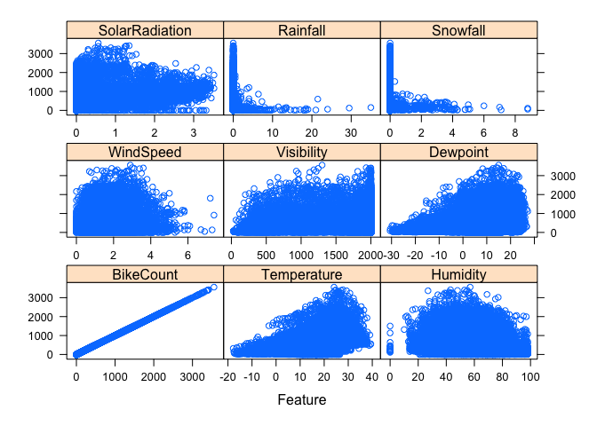
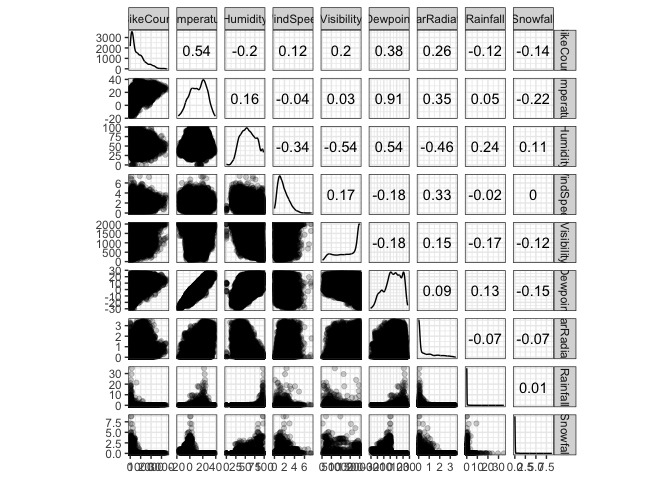
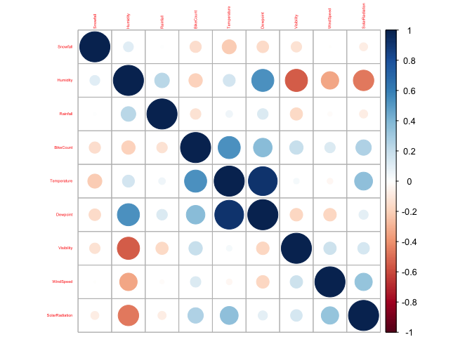
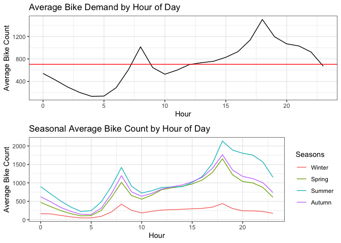
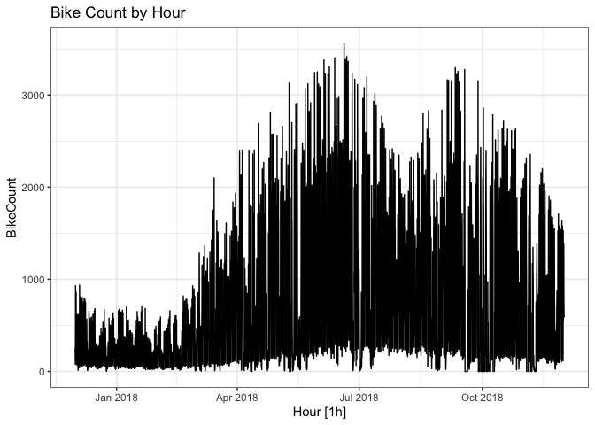
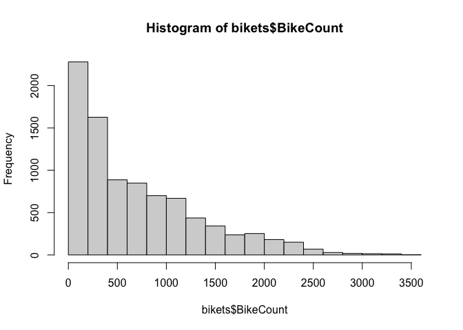
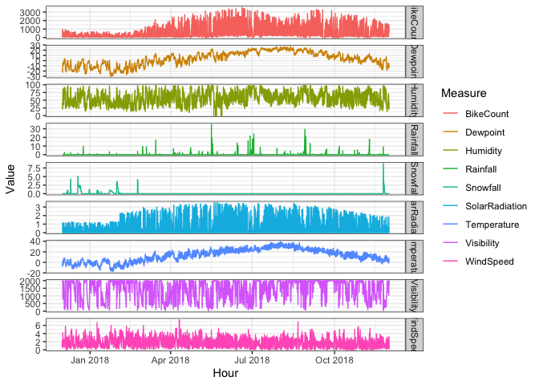
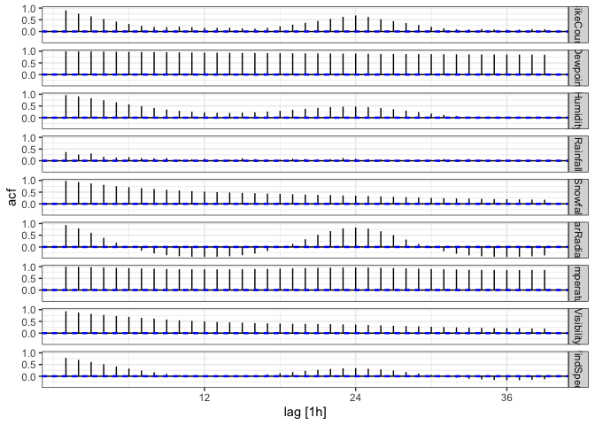

http://archive.ics.uci.edu/ml/bikesets/Seoul+Bike+Sharing+Demand

# Read Data


```r
bike <- readr::read_csv("SeoulBikeData.csv",
                        col_names = c("Date",
                                      "BikeCount",
                                      "Hour",
                                      "Temperature",
                                      "Humidity",
                                      "WindSpeed",
                                      "Visibility",
                                      "Dewpoint",
                                      "SolarRadiation",
                                      "Rainfall",
                                      "Snowfall",
                                      "Seasons",
                                      "Holiday",
                                      "FunctionalDay"),
                        skip = 1,
                        col_types = cols("Hour" = col_time(format = "%H"),
                                         Seasons = "f", 
                                         Holiday = "f",
                                         FunctionalDay = "f"))
```

## Data Cleaning


```r
bikets <- bike %>%
  mutate(
    Hour = parse_date_time(
      paste(Date, Hour),
      orders = c("dmy HMS", "dmY HMS"),
      tz = "Asia/Seoul"
    ),
    .before = everything(),
    Date = NULL
  ) %>%
  as_tsibble(index = Hour)

bikets_tall <- bikets %>%
  select(Hour, where(is.numeric)) %>%
  pivot_longer(cols = -Hour,
               names_to = "Measure",
               values_to = "Value")
  
bikets %>% count_gaps()
```

```
## # A tibble: 0 × 3
## # … with 3 variables: .from <dttm>, .to <dttm>, .n <int>
```

# EDA

## Data Summary


```r
colnames(bikets)
```

```
##  [1] "BikeCount"      "Hour"           "Temperature"    "Humidity"      
##  [5] "WindSpeed"      "Visibility"     "Dewpoint"       "SolarRadiation"
##  [9] "Rainfall"       "Snowfall"       "Seasons"        "Holiday"       
## [13] "FunctionalDay"
```

```r
anyNA(bikets)
```

```
## [1] FALSE
```

```r
dim(bikets)
```

```
## [1] 8760   13
```

```r
str(bikets)
```

```
## tbl_ts [8,760 × 13] (S3: tbl_ts/tbl_df/tbl/data.frame)
##  $ BikeCount     : num [1:8760] 254 204 173 107 78 100 181 460 930 490 ...
##  $ Hour          : POSIXct[1:8760], format: "2017-12-01 00:00:00" "2017-12-01 01:00:00" ...
##  $ Temperature   : num [1:8760] -5.2 -5.5 -6 -6.2 -6 -6.4 -6.6 -7.4 -7.6 -6.5 ...
##  $ Humidity      : num [1:8760] 37 38 39 40 36 37 35 38 37 27 ...
##  $ WindSpeed     : num [1:8760] 2.2 0.8 1 0.9 2.3 1.5 1.3 0.9 1.1 0.5 ...
##  $ Visibility    : num [1:8760] 2000 2000 2000 2000 2000 ...
##  $ Dewpoint      : num [1:8760] -17.6 -17.6 -17.7 -17.6 -18.6 -18.7 -19.5 -19.3 -19.8 -22.4 ...
##  $ SolarRadiation: num [1:8760] 0 0 0 0 0 0 0 0 0.01 0.23 ...
##  $ Rainfall      : num [1:8760] 0 0 0 0 0 0 0 0 0 0 ...
##  $ Snowfall      : num [1:8760] 0 0 0 0 0 0 0 0 0 0 ...
##  $ Seasons       : Factor w/ 4 levels "Winter","Spring",..: 1 1 1 1 1 1 1 1 1 1 ...
##  $ Holiday       : Factor w/ 2 levels "No Holiday","Holiday": 1 1 1 1 1 1 1 1 1 1 ...
##  $ FunctionalDay : Factor w/ 2 levels "Yes","No": 1 1 1 1 1 1 1 1 1 1 ...
##  - attr(*, "key")= tibble [1 × 1] (S3: tbl_df/tbl/data.frame)
##   ..$ .rows: list<int> [1:1] 
##   .. ..$ : int [1:8760] 1 2 3 4 5 6 7 8 9 10 ...
##   .. ..@ ptype: int(0) 
##  - attr(*, "index")= chr "Hour"
##   ..- attr(*, "ordered")= logi TRUE
##  - attr(*, "index2")= chr "Hour"
##  - attr(*, "interval")= interval [1:1] 1h
##   ..@ .regular: logi TRUE
```

```r
summary(bikets) # Investigate BikeCount = 0 and Humidity = 0
```

```
##    BikeCount           Hour                      Temperature    
##  Min.   :   0.0   Min.   :2017-12-01 00:00:00   Min.   :-17.80  
##  1st Qu.: 191.0   1st Qu.:2018-03-02 05:45:00   1st Qu.:  3.50  
##  Median : 504.5   Median :2018-06-01 11:30:00   Median : 13.70  
##  Mean   : 704.6   Mean   :2018-06-01 11:30:00   Mean   : 12.88  
##  3rd Qu.:1065.2   3rd Qu.:2018-08-31 17:15:00   3rd Qu.: 22.50  
##  Max.   :3556.0   Max.   :2018-11-30 23:00:00   Max.   : 39.40  
##     Humidity       WindSpeed       Visibility      Dewpoint      
##  Min.   : 0.00   Min.   :0.000   Min.   :  27   Min.   :-30.600  
##  1st Qu.:42.00   1st Qu.:0.900   1st Qu.: 940   1st Qu.: -4.700  
##  Median :57.00   Median :1.500   Median :1698   Median :  5.100  
##  Mean   :58.23   Mean   :1.725   Mean   :1437   Mean   :  4.074  
##  3rd Qu.:74.00   3rd Qu.:2.300   3rd Qu.:2000   3rd Qu.: 14.800  
##  Max.   :98.00   Max.   :7.400   Max.   :2000   Max.   : 27.200  
##  SolarRadiation      Rainfall          Snowfall         Seasons    
##  Min.   :0.0000   Min.   : 0.0000   Min.   :0.00000   Winter:2160  
##  1st Qu.:0.0000   1st Qu.: 0.0000   1st Qu.:0.00000   Spring:2208  
##  Median :0.0100   Median : 0.0000   Median :0.00000   Summer:2208  
##  Mean   :0.5691   Mean   : 0.1487   Mean   :0.07507   Autumn:2184  
##  3rd Qu.:0.9300   3rd Qu.: 0.0000   3rd Qu.:0.00000                
##  Max.   :3.5200   Max.   :35.0000   Max.   :8.80000                
##        Holiday     FunctionalDay
##  No Holiday:8328   Yes:8465     
##  Holiday   : 432   No : 295     
##                                 
##                                 
##                                 
## 
```

- Notice there are no missing values. However there are some observations with BikeCount = 0, which correspond to non-functional days. Can these be treated as missing values and be imputed? Non-functional days are only present in 2018. 
- Humidity has a minimum value of 0. Is this realistic? (see feature plot for further investigation)


```r
bike %>% group_by(FunctionalDay) %>% summarise(bc = sum(BikeCount))
```

```
## # A tibble: 2 × 2
##   FunctionalDay      bc
##   <fct>           <dbl>
## 1 Yes           6172314
## 2 No                  0
```

```r
bike %>% filter(FunctionalDay == "Yes", BikeCount == 0)
```

```
## # A tibble: 0 × 14
## # … with 14 variables: Date <chr>, BikeCount <dbl>, Hour <time>,
## #   Temperature <dbl>, Humidity <dbl>, WindSpeed <dbl>, Visibility <dbl>,
## #   Dewpoint <dbl>, SolarRadiation <dbl>, Rainfall <dbl>, Snowfall <dbl>,
## #   Seasons <fct>, Holiday <fct>, FunctionalDay <fct>
```

It looks like FunctionalDay=No only has BikeCount = 0, and there are no
FunctionalDay=Yes with BikeCount > 0. Based on this I think it makes sense to
treat those days as missing data (i.e. set `BikeCount=NA`). The imputation
should probably happen during the modeling phase, as different modeling methods
might handle missing data differently.

## Feature Plots

<!-- -->

Something seems to be going on with humidity = 0 values.

\newpage

## Correlation Plot

<!-- --><!-- -->

Dewpoint and Temperature potentially problematic

\newpage

## Bike Demand by Hour of Day

<!-- -->


## Time Series Plots


```r
autoplot(bikets, .vars = BikeCount) + labs(title = "Bike Count by Hour")
```

<!-- -->

```r
hist(bikets$BikeCount)
```

<!-- -->

```r
bikets_tall %>%
  ggplot(aes(x = Hour, y = Value, color = Measure)) +
  geom_line() +
  facet_grid(rows = vars(Measure), scales = "free_y")
```

<!-- -->

```r
ACF(bikets_tall, Value) %>% autoplot()
```

<!-- -->

```r
features(bikets_tall, Value, 
         c(unitroot_kpss, unitroot_ndiffs, unitroot_nsdiffs, ljung_box))
```

```
## # A tibble: 9 × 7
##   Measure        kpss_stat kpss_pvalue ndiffs nsdiffs lb_stat lb_pvalue
##   <chr>              <dbl>       <dbl>  <int>   <int>   <dbl>     <dbl>
## 1 BikeCount         19.0        0.01        1       1   7152.         0
## 2 Dewpoint          32.1        0.01        1       0   8693.         0
## 3 Humidity           3.98       0.01        1       1   8128.         0
## 4 Rainfall           0.710      0.0126      1       0   1243.         0
## 5 Snowfall           2.45       0.01        1       0   8384.         0
## 6 SolarRadiation     3.70       0.01        1       1   7616.         0
## 7 Temperature       34.7        0.01        1       1   8706.         0
## 8 Visibility         2.16       0.01        1       0   7599.         0
## 9 WindSpeed          4.03       0.01        1       0   5375.         0
```

KPSS and Ljung-Box Test both indicate (auto)correlation within each
variable.

# Modeling

## Time Series

* Prophet
* fasster


```r
library(fable.prophet)

holidays <- bikets %>% 
  filter(Holiday == "Holiday") %>%
  mutate(ds = as.Date(Hour)) %>%
  distinct(ds) %>% 
  mutate(holiday = "holiday")

fit <- bikets %>%
  model(
    mdl = prophet(BikeCount ~ season(period = "day", type = "multiplicative") + season(period = "week", type = "multiplicative") + holiday(holidays = holidays)),
  )
components(fit) %>% autoplot()
```

## Machine Learning

* LSTM
* RNN

